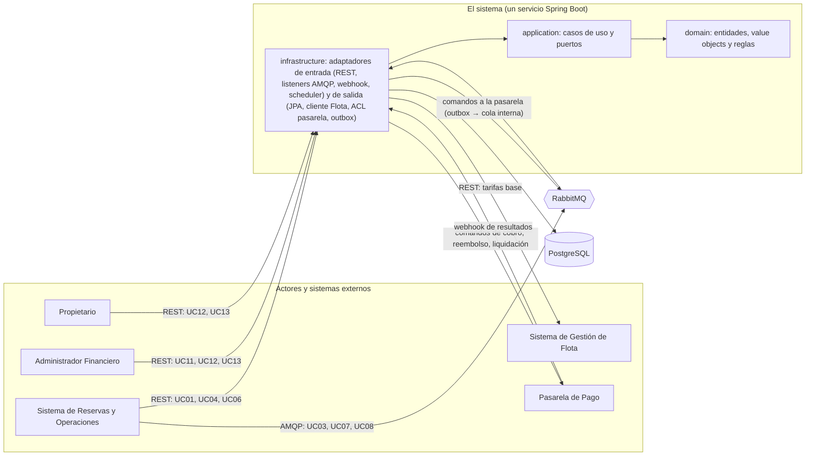
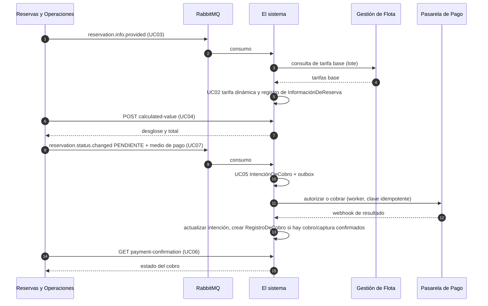

# Implementation Plan: Sistema Financiero de SEA-SHARE (Módulo 3 — "el sistema")

**Date**: 2026-10-03
**Spec**: `docs/features/001-…` a `docs/features/013-…` (UC01–UC13). **Única fuente de verdad.** Los documentos de `docs/context/` son referencia secundaria; cuando discrepan de un SPEC, prevalece el SPEC (ver §12.2).
**Contratos**: [`contracts/`](contracts/README.md) — un archivo `.md` por contrato (REST, colas de eventos e integraciones externas).

---

## Summary

El sistema es el componente financiero de SEA-SHARE: tarifa (incluida la tarifa dinámica), calcula el valor de cada reserva, cobra mediante una pasarela externa, reembolsa, liquida al Propietario, gestiona el depósito de garantía y expone registros e informes financieros. Se construye como **un único servicio Spring Boot con arquitectura hexagonal (Clean Architecture) de tres capas únicas: un `domain`, un `application` y un `infrastructure`**, con **PostgreSQL**, **RabbitMQ** (mensajería con Reservas y desacople de las llamadas a la pasarela) y **Docker**.

Este documento define el orden **general** del proyecto: arquitectura, tecnologías, estructura, modelo de datos, conexiones, índice de contratos y hoja de ruta. De él se derivará un plan **específico** por SPEC en `docs/features/<NNN>-<nombre>/plan.md` (ver §13).

---

## Technical Context

**Language/Version**: Java 25 (`java.version` del `pom.xml`)
  
**Primary Dependencies**: Spring Boot 4.1.1 (parent del `pom.xml`). Spring Web MVC, Validation, Data JPA (Hibernate), AMQP, Security (OAuth2 Resource Server), Actuator, Flyway, MapStruct, Resilience4j, ShedLock (opcional, §5.3), Micrometer (+ Prometheus), ArchUnit
  
**Storage**: PostgreSQL 16+ (`NUMERIC` para dinero, `timestamptz` para instantes)
**Messaging**: RabbitMQ 3.13+ (colas *quorum*, confirmaciones de publicador, DLQ)
  
**Testing**: JUnit 5, AssertJ, Mockito, Testcontainers (PostgreSQL + RabbitMQ), WireMock (Flota y pasarela), Awaitility, ArchUnit  

**Target Platform**: Contenedores Docker (Linux); desarrollo local con Docker Compose
**Project Type**: Servicio backend único (hexagonal), sin frontend propio

**Constraints**: `BigDecimal` en todo cálculo monetario **[SPEC RNF-002 de varios UC]**; sin datos sensibles de medios de pago **[SPEC UC05 RNF-004]**; registros financieros inmutables; manejo controlado de fallas externas **[SPEC RNF-003 de varios UC]**
**Scale/Scope**: 13 casos de uso; sistemas externos: Reservas, Flota, Pasarela; clientes Administrador Financiero y Propietario. El SPEC no define volumen: el diseño es *stateless* y escala horizontalmente.


---

## 1. Alcance y trazabilidad SPEC → componentes

| UC | SPEC | Quién lo invoca | Canal | ¿Responde? | Contrato |
|---|---|---|---|---|---|
| UC01 Solicitar estimación para reserva | 001 | Reservas | REST | Sí | [lote](contracts/rest/UC01-estimacion-lote.md), [individual](contracts/rest/UC01-estimacion-individual.md) |
| UC02 Brindar tarifa base | 002 | Interno (`include` de UC01 y UC03) | Puerto interno | Sí (interno) | Consulta a Flota: [flota-consulta-tarifas-base](contracts/external/flota-consulta-tarifas-base.md) |
| UC03 Brindar información de reserva | 003 | Reservas | **AMQP** | **No** (unidireccional, RF-006) | [UC03](contracts/events/UC03-informacion-reserva.md) |
| UC04 Solicitar el valor calculado de la reserva | 004 | Reservas | REST | Sí | [UC04](contracts/rest/UC04-valor-calculado-reserva.md) |
| UC05 Procesar cobro | 005 | Interno (desde UC07 `PENDIENTE`) + Pasarela (resultado) | Puerto interno + Webhook | No público | [comando](contracts/external/pasarela-comando-cobro.md), [webhook](contracts/external/pasarela-webhook-resultados.md) |
| UC06 Solicitar confirmación de pago | 006 | Reservas | REST | Sí | [UC06](contracts/rest/UC06-confirmacion-pago.md) |
| UC07 Brindar el estado de la reserva | 007 | Reservas | **AMQP** | **No** (RF-009) | [UC07](contracts/events/UC07-estado-reserva.md) |
| UC08 Brindar información de disputa de garantía | 008 | Reservas | **AMQP** | **No** (unidireccional) | [UC08](contracts/events/UC08-disputa-garantia.md) |
| UC09 Reembolsar dinero a arrendatario | 009 | Interno (UC07, UC08) + Pasarela | Puerto interno + Webhook | No público | [comando](contracts/external/pasarela-comando-reembolso.md), [webhook](contracts/external/pasarela-webhook-resultados.md) |
| UC10 Liquidar fondos de alquiler | 010 | Interno (UC07, UC08) + Pasarela | Puerto interno + Webhook | No público | [comando](contracts/external/pasarela-comando-liquidacion.md), [webhook](contracts/external/pasarela-webhook-resultados.md) |
| UC11 Configurar parámetros financieros globales | 011 | Administrador Financiero | REST | Sí | [obtener](contracts/rest/UC11-obtener-parametros-financieros.md), [guardar](contracts/rest/UC11-guardar-parametros-financieros.md) |
| UC12 Consultar registros financieros | 012 | Propietario, Administrador Financiero | REST | Sí | [UC12](contracts/rest/UC12-consultar-registros-financieros.md) |
| UC13 Consultar informe financiero (+ exportar `.csv`) | 013 | Propietario, Administrador Financiero | REST | Sí | [consultar](contracts/rest/UC13-consultar-informe-financiero.md), [exportar](contracts/rest/UC13-exportar-informe-financiero.md) |

**Relaciones del diagrama UML respetadas** (`docs/diagrams/module3-v2.drawio.xml`): `include`: UC01→UC02, UC03→UC02. `extend`: UC08→UC09 y UC08→UC10 (consecuencia financiera de la disputa). UC07 dispara UC05, UC09 y UC10. UC05 consume la salida de UC04; UC06 consulta lo que UC05 registra.

---

## 2. Principios rectores (derivados de los SPEC)

1. **El sistema es dueño del cálculo financiero**: la tarifa dinámica vive solo en UC02 (RF-005); Reservas y Flota no calculan precios (UC01 CE-002).
2. **Flota es la única fuente de la tarifa base** (UC02 RF-004); nunca se asume ni se cachea una tarifa.
3. **Unidireccional significa unidireccional**: UC03, UC07 y UC08 no devuelven nada a Reservas (UC03 RF-006, UC07 RF-009, UC08 RF-009). Los fallos se registran internamente.
4. **Nunca cálculos parciales ni valores asumidos**: ante información incompleta se registra o se responde con error controlado.
5. **Montos solo desde registros internos**: Reservas jamás envía montos (UC08 RF-007, UC10 RF-001).
6. **El sistema no gestiona TTL, ventanas de cancelación ni disputas**: eso es de Reservas; el sistema solo reacciona al estado recibido (UC07, UC08).
7. **Registros inmutables**: `RegistroDeCobro`, `RegistroDeReembolso`, `RegistroDeDispersión` y `RegistroDeComisión` se crean solo con confirmación externa exitosa y nunca se modifican.
8. **Un timeout no es un fallo** (UC05 RNF-003): se concilia, no se asume.

---

## 3. Arquitectura

### 3.1 Vista de contexto



### 3.2 Decisión de módulos: un dominio, una aplicación, una infraestructura

**Decisión**: tres capas únicas dentro de **un solo módulo Maven y un solo despliegue**:

| Capa | Paquete | Responsabilidad |
|---|---|---|
| Dominio | `com.seashare.seasharem3.domain` | Entidades, value objects, políticas y cálculos puros (sin Spring, JPA ni Jackson) |
| Aplicación | `com.seashare.seasharem3.application` | Puertos de entrada (un caso de uso por interfaz), servicios que los implementan y puertos de salida |
| Infraestructura | `com.seashare.seasharem3.infrastructure` | Adaptadores de entrada y salida, persistencia, mensajería, seguridad, configuración |


| Concepto compartido | Casos de uso que lo tocan |
|---|---|
| `InformaciónDeReserva` | UC03 la crea; UC04 la actualiza; UC05, UC07, UC08, UC09 y UC10 la leen |
| `ParámetrosFinancierosGlobales` | UC11 la escribe; UC01, UC02, UC04 y UC10 la leen |
| `IntenciónDeCobro` / `RegistroDeCobro` | UC05 los crea; UC06 la lee; UC08, UC09 y UC10 los usan como "cobro original"; UC12 y UC13 leen el registro |
| Depósito de garantía (un único desenlace: reembolso **o** liquidación) | UC04 lo calcula; UC05 lo cobra; UC08, UC09 y UC10 lo resuelven |
| Registros inmutables | UC05, UC09 y UC10 los crean; UC12 y UC13 los leen |
| Política de tarifa (UC02) | La consumen UC01 y UC03 mediante `include` |

*NOTA:* dentro de cada capa los elementos se agrupan por tema (`pricing`, `reservation`, `payment`, `refund`, `settlement`, `guarantee`, `parameters`, `reporting`) **solo como subpaquetes por legibilidad**; no son fronteras ni tienen reglas de dependencia entre sí.

### 3.3 Estructura del proyecto

```text
seashare-m3/
├── docs/
│   ├── technical-plan/
│   │   ├── general-plan.md                 # Este documento
│   │   └── contracts/                      # Un .md por contrato
│   │       ├── README.md                   # Índice, leyenda y convenciones comunes
│   │       ├── rest/                       # UC01 ×2, UC04, UC06, UC11 ×2, UC12, UC13 ×2
│   │       ├── events/                     # UC03, UC07, UC08
│   │       └── external/                   # Flota y Pasarela
│   ├── templates/ context/ diagrams/ features/NNN-<uc>/{spec.md, plan.md}
├── src/main/java/com/seashare/seasharem3/
│   ├── SeashareM3Application.java
│   ├── domain/
│   │   ├── model/            # ReservationInformation, ChargeIntent, ChargeRecord, RefundIntent, RefundRecord,
│   │   │                     # SettlementIntent, SettlementRecord, CommissionRecord, FinancialParameters, DepositDisposition
│   │   ├── valueobject/      # Money, Percentage, ReservationId, BoatId, OwnerId, ReportPeriod, enums de estado
│   │   ├── service/          # DynamicRatePolicy, HighSeasonCalendar, EasterCalculator (Meeus/Jones/Butcher),
│   │   │                     # PricingCalculator, ReservationValueCalculator, RefundCalculator, SettlementCalculator
│   │   └── exception/        # DomainException y derivadas
│   ├── application/
│   │   ├── port/in/          # Un caso de uso por interfaz (§3.5)
│   │   ├── port/out/         # Persistencia, Flota, pasarela, outbox, registro de fallos, reloj
│   │   ├── service/          # Implementación de los casos de uso
│   │   └── dto/              # Commands y results de aplicación
│   └── infrastructure/
│       ├── adapter/in/{web,messaging,webhook,scheduler}/   # Controllers + DTOs HTTP, listeners AMQP, webhook, jobs
│       ├── adapter/out/{persistence,fleet,gateway,messaging}/  # JPA + mappers, cliente Flota, ACL pasarela, outbox
│       └── config/           # Spring, AMQP, seguridad, Problem Details, observabilidad
├── src/main/resources/{application.properties, db/migration/V*.sql}
├── src/test/java/…           # espejo de paquetes + arch/ (ArchUnit) + contract/
├── Dockerfile
├── docker-compose.yml
└── pom.xml
```

### 3.4 Reglas de dependencia (verificadas con ArchUnit en CI)

1. `..domain..` no depende de Spring, JPA, Jackson, AMQP ni de `..application..` / `..infrastructure..`.
2. `..application..` solo depende de `..domain..` (se permite `@Transactional` como excepción pragmática documentada).
3. `..infrastructure.adapter.in..` solo invoca `application.port.in`; `..infrastructure.adapter.out..` solo implementa `application.port.out`.
4. Un caso de uso que necesite a otro (UC01→UC02, UC07→UC05/UC09/UC10) lo invoca **únicamente por su `port.in`**, nunca por el servicio concreto.
5. Ningún controller, listener, webhook o job accede a un repositorio.
6. Las entidades JPA no salen de `infrastructure.adapter.out.persistence`.
7. Los DTOs HTTP/AMQP **[SPEC RNF-001 de varios UC]** viven en `infrastructure.adapter.in`; `application` trabaja con `command`/`result`.

### 3.5 Mapa SPEC → componentes (semilla de los planes específicos)

| UC | Puertos de entrada (`application.port.in`) | Puertos de salida principales (`port.out`) | Adaptador de entrada | Persistencia | Invariantes clave |
|---|---|---|---|---|---|
| UC01 | `EstimateBatchUseCase`, `EstimateSingleUseCase` | `FleetRatePort` (vía UC02), `FinancialParametersRepository` | `web` | — | `tarifa×días + seguro×pasajeros`; defaults 1 día / 1 pasajero / fecha actual; días inclusivos; límite de lote; advertencia obligatoria en individual |
| UC02 | `ProvideBaseRateUseCase` (solo interno) | `FleetRatePort`, `FinancialParametersRepository` | — | — | Calendario exacto (RF-006); `max(fin de semana, temporada alta)`; sin tipo/categoría de embarcación |
| UC03 | `RegisterReservationInformationUseCase` | `ReservationInformationRepository`, `FailureRecorderPort` | `messaging` | `reservation_information` | *Upsert*; `1 ≤ pasajeros ≤ capacidad`; `fin ≥ inicio`; no persiste incompletos; conserva versión válida previa |
| UC04 | `CalculateReservationValueUseCase` | `ReservationInformationRepository`, `FinancialParametersRepository` | `web` | `reservation_information` (montos) | Depósito = 10 % de la tarifa base diaria; total = alquiler + seguro + depósito |
| UC05 | `ProcessChargeUseCase`, `RegisterChargeResultUseCase`, `ExpireStaleAuthorizationsUseCase` | `ChargeGatewayPort`, `ReservationInformationRepository`, `OutboxPort` | invocado por UC07; `webhook`; `scheduler` | `charge_intent`, `charge_record` | Un solo monto (alquiler + seguro + depósito); solo token; `RegistroDeCobro` solo con cobro/captura confirmados |
| UC06 | `GetPaymentConfirmationUseCase` | `ChargeIntentRepository` | `web` | lectura de `charge_intent` | Solo lectura; no contacta la pasarela (RF-006) |
| UC07 | `HandleReservationStatusUseCase` | `ProcessChargeUseCase`, `RequestRefundUseCase`, `RequestSettlementUseCase`, `OpenDepositTrackingUseCase` (por `port.in`) | `messaging` | `reservation_status_log` | 10 estados; estado desconocido = inconsistencia registrada; sin respuesta |
| UC08 | `HandleDisputeNotificationUseCase`, `OpenDepositTrackingUseCase` | `RequestRefundUseCase`, `RequestSettlementUseCase` (por `port.in`) | `messaging` | `deposit_disposition`, `dispute_event_log` | Solo `PENDIENTE/RECHAZADO/COMPLETADO`; 100 % del depósito; un único desenlace por depósito |
| UC09 | `RequestRefundUseCase`, `RegisterRefundResultUseCase` | `RefundGatewayPort`, `ReservationInformationRepository`, `ChargeIntentRepository` | invocado por UC07/UC08; `webhook` | `refund_intent`, `refund_record` | Montos por estado; "liberar o reembolsar según el estado del cobro original"; sin descuentos transaccionales propios (RF-012) |
| UC10 | `RequestSettlementUseCase`, `RegisterSettlementResultUseCase` | `SettlementGatewayPort`, `ReservationInformationRepository`, `FinancialParametersRepository` | invocado por UC07/UC08; `webhook` | `settlement_intent`, `settlement_record`, `commission_record` | Liquidación estándar `alquiler − comisión − seguro`; penalidades sin comisión ni seguro; `RegistroDeDispersión` + `RegistroDeComisión` atómicos |
| UC11 | `LoadFinancialParametersUseCase`, `SaveFinancialParametersUseCase` | `FinancialParametersRepository` | `web` | `financial_parameters` | Guardado atómico de los 4 valores; rangos 0–100 % y seguro ≥ 0; sin historial; solo Administrador Financiero |
| UC12 | `QueryFinancialRecordsUseCase` | `FinancialRecordQueryPort` | `web` | vista `v_financial_records` | Alcance del Propietario antes de filtros; paginación sin omitir ni duplicar; solo registros inmutables |
| UC13 | `GetFinancialReportUseCase`, `ExportFinancialReportUseCase` | `FinancialReportQueryPort` | `web` | agregación sobre las 4 tablas inmutables | Períodos fijos; neto sin doble contabilizar la comisión; variación porcentual no calculable si el anterior es 0 |


## 4. Modelo de datos (PostgreSQL)

Convenciones: `NUMERIC` para dinero y porcentajes (escala y redondeo: **[PEND] OQ-03**), `timestamptz` para instantes, UUID como identificadores (**[PEND] OQ-05**), migraciones versionadas con Flyway.

| Tabla | Tipo | Propósito / columnas relevantes | Restricciones |
|---|---|---|---|
| `financial_parameters` | Singleton | `commission_pct`, `insurance_fee_per_passenger`, `weekend_increase_pct`, `high_season_increase_pct`, `updated_at`, `updated_by` | `id = 1`; `CHECK` de rangos (UC11 RF-013); sin historial ni versión: cada guardado sobrescribe (UC11) |
| `reservation_information` | Entidad (UC03/UC04) | `reservation_id` PK, `boat_id`, `base_rate`, `start_date`, `end_date`, `passengers`, `owner_id`, `max_capacity`, `rental_amount`, `insurance_amount`, `deposit_amount`, `total_amount`, `calculated_at` | `CHECK (end_date >= start_date)`; `CHECK (passengers BETWEEN 1 AND max_capacity)`; montos `NULL` hasta UC04 |
| `charge_intent` | Entidad (UC05) | `id`, `reservation_id`, `idempotency_key`, `status`, montos (`authorized/captured/released/charged`), `payment_token_ref`, `payment_method_type`, `last_four`, `external_reference`, `authorization_expires_at`, `version` | `UNIQUE(idempotency_key)`; `UNIQUE(reservation_id)` (**[PEND] OQ-13**) |
| `charge_record` | **Inmutable** | `id`, `reservation_id`, `owner_id`, `boat_id`, `amount`, `rental_amount`, `insurance_amount`, `deposit_amount`, `payment_method_type`, `last_four`, `external_reference`, `created_at` | Trigger anti-`UPDATE/DELETE` |
| `refund_intent` | Entidad (UC09) | `id`, `reservation_id`, `trigger` (estado/evento), `scope`, `amount`, `charge_intent_id`, `idempotency_key`, `status`, `external_reference` | `UNIQUE(idempotency_key)` |
| `refund_record` | **Inmutable** | `id`, `reservation_id`, `owner_id`, `boat_id`, `dispute_id` (nullable), `amount`, `detail`, `transaction_cost` (nullable), `external_reference`, `created_at` | Trigger anti-mutación |
| `settlement_intent` | Entidad (UC10) | `id`, `reservation_id`, `trigger`, `scope` (`STANDARD`, `CANCELLATION_COMPENSATION`, `DEPOSIT`), `amount`, `commission_amount`, `deposit_amount`, `charge_intent_id`, `idempotency_key`, `status` | `UNIQUE(idempotency_key)` |
| `settlement_record` | **Inmutable** | `id`, `reservation_id`, `owner_id`, `boat_id`, `amount`, `detail`, `rental_gross_amount`, `insurance_amount`, `deposit_amount`, `external_reference`, `created_at` | Trigger anti-mutación |
| `commission_record` | **Inmutable** | `id`, `settlement_record_id`, `settlement_intent_id`, `reservation_id`, `owner_id`, `boat_id`, `amount`, `created_at` | `UNIQUE(settlement_record_id)` (una comisión por liquidación estándar, UC10 CE-006) |
| `deposit_disposition` | Entidad (UC08) | `reservation_id` PK, `completed_at` (de `fechaHoraEstado` de `COMPLETADA`), `dispute_id`, `dispute_status`, `disposition` (`HELD`, `REFUND_REQUESTED`, `SETTLEMENT_REQUESTED`) | Cambio de `disposition` por *compare-and-set* |
| `dispute_event_log` | Técnica (UC08) | `reservation_id`, `dispute_id`, `event_key`, `status`, `status_changed_at`, `processed_at` | `UNIQUE(reservation_id, dispute_id, event_key)` (UC08 RF-008) |
| `reservation_status_log` | Técnica (UC07) | `reservation_id`, `status`, `status_changed_at`, `processed_at`, `outcome` | `UNIQUE(reservation_id, status)` para los estados que disparan operaciones monetarias (cancelaciones y `COMPLETADA`) |
| `operational_failure` | Técnica | `use_case`, `reservation_id`, `reason`, `payload_ref`, `created_at`, `resolved` | Destino de todo "registra el fallo internamente" |
| `outbox_message` | Técnica | `id`, `exchange`, `routing_key`, `payload`, `created_at`, `published_at` | Índice parcial `published_at IS NULL` |
| `shedlock` | Técnica (opcional) | Bloqueo de jobs programados | — |

**Vista de lectura (UC12/UC13)**: `v_financial_records` = `UNION ALL` de las cuatro tablas inmutables con columnas comunes (`record_type`, `reservation_id`, `owner_id`, `boat_id`, `amount`, `created_at`, `external_reference`). Índices por `(owner_id, created_at DESC)`, `(boat_id)` y `(reservation_id)` en cada tabla.

**Inmutabilidad**: además de no exponer *setters* en el dominio, las cuatro tablas `*_record` tienen un trigger que rechaza `UPDATE` y `DELETE`, y el usuario de la aplicación no recibe esos privilegios.

---

## 5. Conexiones con otros módulos y mensajería (RabbitMQ)

### 5.1 Matriz de conexiones

| # | Origen → Destino | UC | Estilo | Transporte | ¿Cola? | Contrato |
|---|---|---|---|---|---|---|
| C1 | Reservas → sistema | UC01 | Request/response | REST `POST` | No (necesita respuesta) | [lote](contracts/rest/UC01-estimacion-lote.md), [individual](contracts/rest/UC01-estimacion-individual.md) |
| C2 | Reservas → sistema | UC03 | Notificación unidireccional | **RabbitMQ** | **Sí** | [UC03](contracts/events/UC03-informacion-reserva.md) |
| C3 | Reservas → sistema | UC04 | Request/response | REST `POST` | No | [UC04](contracts/rest/UC04-valor-calculado-reserva.md) |
| C4 | Reservas → sistema | UC06 | Consulta | REST `GET` | No | [UC06](contracts/rest/UC06-confirmacion-pago.md) |
| C5 | Reservas → sistema | UC07 | Notificación unidireccional | **RabbitMQ** | **Sí** | [UC07](contracts/events/UC07-estado-reserva.md) |
| C6 | Reservas → sistema | UC08 | Notificación unidireccional | **RabbitMQ** | **Sí** | [UC08](contracts/events/UC08-disputa-garantia.md) |
| C7 | Sistema → Flota | UC01/02/03 | Request/response | REST `POST` (consulta por lote) | No | [Flota](contracts/external/flota-consulta-tarifas-base.md) |
| C8 | Sistema → Pasarela | UC05/09/10 | Comando asíncrono | Outbox → **RabbitMQ interna** → worker → cliente de la pasarela | **Sí** | [cobro](contracts/external/pasarela-comando-cobro.md), [reembolso](contracts/external/pasarela-comando-reembolso.md), [liquidación](contracts/external/pasarela-comando-liquidacion.md) |
| C9 | Pasarela → sistema | UC05/09/10 | Resultado | Webhook REST | No | [webhook](contracts/external/pasarela-webhook-resultados.md) |
| C10 | Administrador Financiero → sistema | UC11 | Request/response | REST | No | [obtener](contracts/rest/UC11-obtener-parametros-financieros.md), [guardar](contracts/rest/UC11-guardar-parametros-financieros.md) |
| C11 | Propietario / Administrador → sistema | UC12, UC13 | Request/response | REST | No | [UC12](contracts/rest/UC12-consultar-registros-financieros.md), [consultar](contracts/rest/UC13-consultar-informe-financiero.md), [exportar](contracts/rest/UC13-exportar-informe-financiero.md) |
| C12 | Sistema → sistema | UC05 | Eventos por tiempo | Scheduler | No (ver D-10) | §5.2 |

El sistema **no publica eventos hacia Reservas**: Reservas consulta mediante UC04 y UC06 (modelo *pull* definido por los SPEC).

### 5.2 Jobs internos programados

| Job | Origen en los SPEC | Regla |
|---|---|---|
| `AuthorizationExpiryJob` | UC05 RF-014 / RNF-005 | Marca como `EXPIRADO` las autorizaciones aprobadas y no capturadas al vencer su vigencia |
| `GatewayReconciliationJob` | UC05/09/10 RNF-003 | Reintenta o consulta intenciones sin resultado definitivo |
| `OutboxRelayJob` | Infra | Publica `outbox_message` pendientes |

Estos son **los únicos jobs programados del sistema y son internos** (expiración de autorizaciones, conciliación con la pasarela y entrega de la mensajería). La ventana de 24 h, la vigencia de las disputas y cualquier otro temporizador relacionado con una reserva o con la garantía **no son responsabilidad del sistema**: los administra el Sistema de Reservas y Operaciones, que notifica `RECHAZADO` (ausencia de reclamo) o `COMPLETADO`/`PENDIENTE` mediante UC08 [SPEC 008 RF-009, RF-009A; SPEC 007 caso extremo].

La topología de exchanges y colas se documenta en [`contracts/README.md`](contracts/README.md) §Topología RabbitMQ **[TÉC; nombres a acordar con Reservas — OQ-09]**.

### 5.3 ShedLock (bloqueo de jobs programados) **[TÉC]**

Si el servicio corre con varias réplicas, cada job de §5.2 se protege con **ShedLock** sobre la tabla `shedlock` (§4) para que solo una réplica lo ejecute por periodo. Es un mecanismo de despliegue, no un temporizador de negocio: no crea ni sustituye ninguna tarea programada fuera de la lista de §5.2.

### 5.4 Flujo de referencia: reserva → cobro


## 6. Contratos

Cada contrato vive en su propio archivo en [`contracts/`](contracts/README.md). Allí se encuentran la leyenda `[SPEC]/[CONV]/[PEND]`, las convenciones comunes (headers, formato de error, catálogo de códigos) y el detalle de cada petición y respuesta.

| Tipo | Archivo | Detalle |
|---|---|---|
| REST | [`rest/UC01-estimacion-lote.md`](contracts/rest/UC01-estimacion-lote.md) | Reservas → sistema |
| REST | [`rest/UC01-estimacion-individual.md`](contracts/rest/UC01-estimacion-individual.md) | Reservas → sistema |
| REST | [`rest/UC04-valor-calculado-reserva.md`](contracts/rest/UC04-valor-calculado-reserva.md) | Reservas → sistema |
| REST | [`rest/UC06-confirmacion-pago.md`](contracts/rest/UC06-confirmacion-pago.md) | Reservas → sistema |
| REST | [`rest/UC11-obtener-parametros-financieros.md`](contracts/rest/UC11-obtener-parametros-financieros.md) | Administrador Financiero → sistema |
| REST | [`rest/UC11-guardar-parametros-financieros.md`](contracts/rest/UC11-guardar-parametros-financieros.md) | Administrador Financiero → sistema |
| REST | [`rest/UC12-consultar-registros-financieros.md`](contracts/rest/UC12-consultar-registros-financieros.md) | Propietario / Administrador → sistema |
| REST | [`rest/UC13-consultar-informe-financiero.md`](contracts/rest/UC13-consultar-informe-financiero.md) | Propietario / Administrador → sistema |
| REST | [`rest/UC13-exportar-informe-financiero.md`](contracts/rest/UC13-exportar-informe-financiero.md) | Propietario / Administrador → sistema |
| Cola | [`events/UC03-informacion-reserva.md`](contracts/events/UC03-informacion-reserva.md) | Reservas → sistema, unidireccional |
| Cola | [`events/UC07-estado-reserva.md`](contracts/events/UC07-estado-reserva.md) | Reservas → sistema, unidireccional |
| Cola | [`events/UC08-disputa-garantia.md`](contracts/events/UC08-disputa-garantia.md) | Reservas → sistema, unidireccional |
| Externo | [`external/flota-consulta-tarifas-base.md`](contracts/external/flota-consulta-tarifas-base.md) | Sistema → Flota (contrato requerido) |
| Externo | [`external/pasarela-comando-cobro.md`](contracts/external/pasarela-comando-cobro.md) | Sistema → Pasarela |
| Externo | [`external/pasarela-comando-reembolso.md`](contracts/external/pasarela-comando-reembolso.md) | Sistema → Pasarela |
| Externo | [`external/pasarela-comando-liquidacion.md`](contracts/external/pasarela-comando-liquidacion.md) | Sistema → Pasarela |
| Externo | [`external/pasarela-webhook-resultados.md`](contracts/external/pasarela-webhook-resultados.md) | Pasarela → sistema |

### Entrega y verificación

| Destinatario | Contratos | Qué debe hacer |
|---|---|---|
| Reservas y Operaciones | UC01, UC04, UC06 (REST); UC03, UC07, UC08 (colas) | Implementar cliente REST y productor AMQP |
| Gestión de Flota | `flota-consulta-tarifas-base` | Exponer la consulta por lote con el SLA del SPEC |
| Pasarela de Pago (adaptador) | comandos + webhook | Mapear el proveedor elegido al modelo canónico (OQ-08) |
| Administrador Financiero / Propietario | UC11, UC12, UC13 | Consumir los endpoints respetando paginación y períodos fijos |

**Verificación**: pruebas de contrato en el sistema que usan los ejemplos de cada `.md` (REST con MockMvc; mensajes AMQP contra el cuerpo documentado) y *stubs* WireMock para Flota y la pasarela.

---

## 7. Aspectos transversales

### 7.1 Seguridad
- Los SPEC fijan **quién puede usar cada caso de uso** (UC11 solo Administrador Financiero, RF-008; UC12/UC13 Propietario y Administrador Financiero; UC03/UC07/UC08 solo Reservas, UC03 RF-008) pero **no el mecanismo de autenticación** (**OQ-01**). Propuesta por defecto **[TÉC]**: OAuth2 Resource Server (JWT) con roles `ADMIN_FINANCIERO`, `PROPIETARIO` y una credencial de servicio para Reservas.
- El `owner_id` del Propietario se toma de la identidad autenticada, nunca del cuerpo ni de la URL (UC12 RF-003, UC13 RF-006).
- Datos de pago: solo token, tipo y últimos cuatro dígitos; sin PAN, CVV ni vencimiento; el token no se escribe en logs (UC05 RNF-004, CE-005).
- Webhook: verificación de autenticidad del emisor; el mecanismo depende del proveedor (OQ-08).

### 7.2 Resiliencia (valores iniciales **[TÉC]** a calibrar)
| Dependencia | Timeout | Reintentos | Otros |
|---|---|---|---|
| Flota (REST) | 1 s lectura (SLA del SPEC: < 500 ms para 50 embarcaciones) | 1 con *backoff* corto | *Circuit breaker*; falla ⇒ error controlado, **sin estimaciones parciales** (UC01 RNF-003) |
| Pasarela (worker) | 10 s | Por reintento del mensaje, **misma clave idempotente** | Timeout ⇒ estado `FALLA_COMUNICACION` / en conciliación, nunca "fallido" (UC05 RNF-003) |
| Listeners AMQP | — | 3–5 con *backoff* solo en fallas transitorias → DLQ | [`contracts/README.md`](contracts/README.md) §Reglas de consumo |

### 7.3 Observabilidad
Actuator (`/health`, `/metrics`), Micrometer + Prometheus, logs JSON con `reservation_id`. Métricas: profundidad de DLQ, intenciones por estado, antigüedad de la intención más vieja sin resultado, filas en `operational_failure`, latencia de Flota. Alertas sobre DLQ > 0 y conciliaciones atascadas, porque los casos unidireccionales no pueden avisar a Reservas.

### 7.4 Configuración **[TÉC]** (sobreescribible por entorno)
`seashare.timezone` (OQ-04), `seashare.estimates.max-batch-size=50`, `seashare.reporting.max-page-size=100`, `seashare.fleet.*`, `seashare.gateway.*`. No hay configuración de ventanas ni de disputas (24 h, vigencias): la administra Reservas [SPEC 008 RF-009].

---


## 10. Estados internos de las intenciones

| Intención | Estados internos | Mapeo hacia UC06 (solo cobro) |
|---|---|---|
| `ChargeIntent` | `PENDIENTE_ENVIO`, `EN_PROCESO`, `AUTORIZADO`, `CAPTURADO`, `RECHAZADO`, `CANCELADO`, `EXPIRADO`, `FALLA_COMUNICACION` | `PENDIENTE_ENVIO`/`EN_PROCESO` → `EN_PROCESO`; `AUTORIZADO`/`CAPTURADO` → `APROBADO`; `RECHAZADO` → `RECHAZADO`; `CANCELADO` → `CANCELADO`; `EXPIRADO` → `EXPIRADO`; `FALLA_COMUNICACION` → `DESCONOCIDO` (**OQ-12**) |
| `RefundIntent`, `SettlementIntent` | `PENDIENTE_ENVIO`, `EN_PROCESO`, `COMPLETADO`, `RECHAZADO`, `CANCELADO`, `EXPIRADO`, `FALLA_COMUNICACION` | No se exponen |

El registro inmutable correspondiente se crea **solo** al pasar a un estado exitoso confirmado externamente (UC05 RF-006/RF-008, UC09 RF-007/RF-009, UC10 RF-010/RF-012); los demás estados únicamente actualizan la intención.

---

## 11. Decisiones de diseño y justificación

| ID | Decisión | Alternativas descartadas | Justificación | SPEC |
|---|---|---|---|---|
| D-01 | **Un solo servicio desplegable** | Un microservicio por caso de uso | 13 casos de uso acoplados por datos (intenciones, registros, depósito); la consistencia transaccional es más simple en una sola BD | Todos |
| D-02 | **Un `domain`, un `application` y un `infrastructure`** en un único módulo Maven, con reglas verificadas por ArchUnit (§3.2) | Un módulo/paquete por feature; dos módulos de dominio; multi-módulo Maven por capa | El acoplamiento de datos de §3.2 hace artificial cualquier frontera por SPEC; ArchUnit da el mismo control de capas que el multi-módulo con menos ceremonia | Todos |
| D-03 | Subpaquetes temáticos dentro de cada capa **sin reglas entre ellos** | Fronteras duras por tema | Legibilidad sin reintroducir modularidad innecesaria | Todos |
| D-04 | Dominio puro + **modelos JPA separados** con MapStruct | Anotar el dominio con JPA | Dominio libre de framework y registros realmente inmutables; MapStruct ya está en el `pom.xml` | RNF de inmutabilidad |
| D-05 | **Contratos en Markdown, uno por archivo**, derivados solo de los SPEC y etiquetados `[SPEC]/[CONV]/[PEND]` | Un único documento; OpenAPI/AsyncAPI generados antes del código | Pedido explícito; la etiqueta hace visible qué es spec y qué es convención | Todos |
| D-06 | **REST** para request/response; **RabbitMQ** para los casos unidireccionales y los comandos a la pasarela | Todo REST; todo mensajería | UC01/04/06 y la consulta a Flota necesitan respuesta inmediata. UC03/07/08 no devuelven nada (RF-006/RF-009) y se benefician de desacople, durabilidad y reintentos | 001, 003, 004, 006, 007, 008 |
| D-07 | Entrega **al-menos-una-vez** + **idempotencia por claves de negocio de los SPEC** + outbox para comandos | "Exactly-once"; tabla *inbox* por `message_id` | Exactly-once no es alcanzable entre BD y broker. Los SPEC ya definen las claves de deduplicación; un `message_id` no está en ningún SPEC | 005, 007, 008, 009, 010 |
| D-08 | **Persistir intención → outbox → worker llama a la pasarela**; conciliación posterior | Llamar a la pasarela dentro de la transacción o del listener | No bloquea consumidores con una llamada lenta; un timeout no se interpreta como fallo (UC05 RNF-003) | 005, 009, 010 |
| D-09 | UC05 **sin endpoint público**; se invoca desde UC07 `PENDIENTE` con el token | Endpoint de cobro para Reservas/Arrendatario | UC07 RF-002A define que `PENDIENTE` dispara el cobro con el token recibido junto al estado; un segundo canal duplicaría el disparador | 005, 007 |
| D-10 | **Scheduler** solo para jobs internos (expiración de autorizaciones, conciliación y outbox) | Mensajes diferidos (TTL + DLX) por reserva | El sondeo sobre BD es simple, auditable e idempotente; la ventana de 24 h y la vigencia de la disputa las administra Reservas (SPEC 008 RF-009) | 005, Infra |
| D-11 | `Money` (VO) sobre `BigDecimal`, `NUMERIC` en BD y *string* decimal en JSON | `double`/`float`; número JSON | Evita errores de redondeo (UC01 CE-001, UC04 CE-001) | 001, 004, 005, 009, 010 |
| D-12 | Fechas de negocio y períodos en una zona horaria única (propuesta `America/Bogota`); instantes en UTC | UTC para todo | "Fecha actual", "inicio en el pasado" y los períodos de UC13 deben ser inequívocos (**OQ-04**) | 001, 013 |
| D-13 | Inmutabilidad también en BD (trigger + privilegios) | Solo convención en código | Los registros son base de auditoría e informes | 005, 009, 010 |
| D-14 | **CQRS ligero** para UC12/UC13: vista `UNION ALL` + SQL de agregación | Pasar por el dominio | Son solo lectura (UC12 RF-010, UC13 RF-013) | 012, 013 |
| D-15 | **Bloqueo asesor por reserva** + `@Version` en intenciones | Bloqueo global; serializable | Serializa operaciones de dinero de una reserva sin frenar al resto | 007, 008, 009, 010 |
| D-16 | `deposit_disposition` con *compare-and-set* | Validar solo en cada caso de uso | Un depósito solo puede reembolsarse **o** liquidarse una vez (UC08 CE-005) | 008, 009, 010 |
| D-17 | UC04 **devuelve el desglose ya registrado** si sigue vigente y solo lo recalcula si UC03 lo invalidó (**OQ-07**) | Recalcular siempre con los parámetros vigentes | Reconcilia el "mismo desglose" de UC04 con UC11 RF-007 (parámetros nuevos no afectan valores ya registrados) | 004, 011 |
| D-18 | Enumeraciones en español idénticas a los SPEC; campos JSON en `snake_case` (`boat_ids` ya lo fija) | Traducir enumeraciones | Cero traducción entre SPEC y contrato | 001, 007, 008 |
| D-19 | **No cachear** tarifas de Flota | Caché con TTL | Flota es la fuente autoritativa (UC02 RF-004) | 002 |
| D-20 | Resilience4j (timeout, reintento, *circuit breaker*) configurable | Reintentos manuales | Evita estados de carga infinita (UC01 CE-004) | 001, 002, 005 |
| D-21 | OAuth2/JWT con roles; `owner_id` desde la identidad (**OQ-01**) | `owner_id` en el cuerpo | El alcance del Propietario no puede depender de un dato manipulable | 011, 012, 013 |
| D-22 | Límite de lote = **50**; tamaño máximo de página = **100** | 100 como lote; sin máximo | UC01 RF-006 deja abierto "50 o 100"; 50 coincide con la prueba de carga de Flota. El máximo de página protege el tamaño de respuesta (OQ-16) | 001, 012 |
| D-23 | Código y API en **inglés**; documentación en español con la tabla de §14 | Identificadores en español con tildes | Evita problemas de herramientas; §14 mantiene el lenguaje ubicuo | Todos |
| D-24 | `financial_parameters` como **singleton sin historial ni versión** (último guardado gana) | Tabla con historial; *optimistic locking* | UC11 indica que se sobrescribe y no se conserva historial; el guardado atómico de una sola fila da una única versión coherente (RNF-003) | 011 |
| D-25 | Tablas técnicas `deposit_disposition`, `dispute_event_log`, `reservation_status_log` | Persistir el estado operativo de la reserva | UC07 prohíbe persistir el estado operativo; solo se guarda lo necesario para idempotencia y para decidir la operación monetaria | 007, 008 |

---


## 12. Dependencias y orden de ejecución

### Dependencias entre fases
- **Setup (1)** → sin dependencias. **Foundational (2)** → depende de 1 y **bloquea** todo lo demás.
- **UC11 (3)** → antes de 4, 5, 6 y 7 (todas leen parámetros).
- **UC02/UC01 (4)** → depende de 3 y 2. **UC03/UC04 (5)** → depende de 4 (UC03 incluye UC02) y 3.
- **UC05/UC06 (6)** → depende de 5. **UC09/UC10 (7)** → dependen de 6 (cobro original) y 5; pueden desarrollarse en paralelo.
- **UC08 (8)** → depende de 7. **UC07 (9)** → depende de 6, 7 y 8 (orquesta todo). **UC12/UC13 (10)** → pueden iniciar tras definirse las tablas inmutables (6 y 7) y completarse al final.
- **Polish (N)** → después de las fases deseadas.

```text
1 Setup → 2 Foundational → 3 UC11 → 4 UC02/UC01 → 5 UC03/UC04 → 6 UC05/UC06 → 7 UC09/UC10 → 8 UC08 → 9 UC07
                                                                     └──────────────► 10 UC12/UC13 (tras 6 y 7) ───────► N Polish
```


### Qué debe contener cada plan específico por SPEC (`docs/features/NNN-…/plan.md`)
1. Resumen y trazabilidad a los RF/RNF/CE del SPEC.
2. Clases concretas (dominio, puertos, servicios, adaptadores) con rutas reales bajo `com.seashare.seasharem3`.
3. Migración SQL exacta; referencia al contrato `.md` correspondiente.
4. Reglas de negocio con ejemplos numéricos y manejo de errores por escenario.
5. Estrategia de pruebas con una prueba por cada criterio de éxito (`CE-xxx`).
6. Tareas granulares con dependencias y los puntos abiertos (OQ) que lo afecten.

---

## 13. Lenguaje ubicuo (SPEC → código)

| Término del SPEC | Identificador en código |
|---|---|
| InformaciónDeReserva | `ReservationInformation` |
| IntenciónDeCobro / RegistroDeCobro | `ChargeIntent` / `ChargeRecord` |
| IntenciónDeReembolso / RegistroDeReembolso | `RefundIntent` / `RefundRecord` |
| IntenciónDeDispersión / RegistroDeDispersión | `SettlementIntent` / `SettlementRecord` |
| RegistroDeComisión | `CommissionRecord` |
| ParámetrosFinancierosGlobales | `FinancialParameters` |
| Tarifa base / tarifa dinámica | `BaseRate` / `DynamicRatePolicy` |
| Depósito de garantía | `GuaranteeDeposit` |
| Seguro náutico | `NauticalInsurance` |
| Arrendatario / Propietario | `Renter` / `Owner` |
| Sistema de Reservas y Operaciones / Gestión de Flota | `reservations` / `fleet` (sistemas externos) |

---

## Notes

- `[UCxx]` mapea cada tarea a su SPEC; `[P]` indica tareas paralelizables (archivos distintos, sin dependencia).
- Cada fase debe poder validarse de forma independiente antes de pasar a la siguiente.
- Confirmar los puntos abiertos de §12.1 antes de implementar el SPEC al que afectan; hasta entonces rige la propuesta por defecto.
- Evitar: tareas vagas, conflictos en un mismo archivo, llamadas entre casos de uso que no pasen por `port.in`.
- Los valores numéricos de los ejemplos en los contratos son ilustrativos.