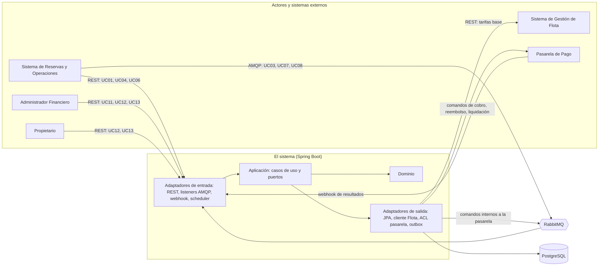
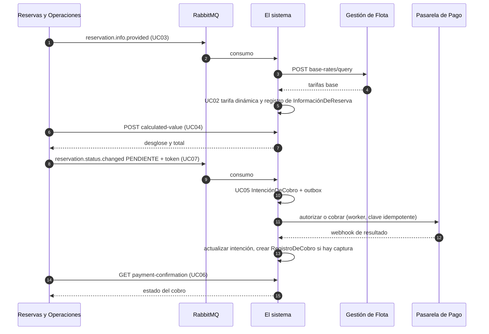

# Implementation Plan: Sistema Financiero de SEA-SHARE (Módulo 3 — "el sistema")

**Date**: 2026-10-01
**Spec**: `docs/features/001-…` a `docs/features/013-…` (UC01–UC13). Única fuente de verdad. Los documentos de `docs/context/` son referencia secundaria; cuando discrepan de un SPEC, prevalece el SPEC (ver §12.2).

---

## Summary

El sistema es el componente financiero de SEA-SHARE: tarifa (incluida la tarifa dinámica), calcula el valor de cada reserva, cobra mediante una pasarela externa, reembolsa, liquida al Propietario, gestiona el depósito de garantía y expone registros e informes financieros. Se construye como **un único servicio Spring Boot con arquitectura hexagonal (Clean Architecture)**, **PostgreSQL** como almacenamiento, **RabbitMQ** para la mensajería asíncrona con otros módulos y para desacoplar las llamadas a la pasarela, y **Docker** para empaquetado y entornos.

Este documento define el orden **general** del proyecto: arquitectura, tecnologías, estructura, modelo de datos, conexiones con otros módulos, contratos y hoja de ruta. De él se derivará un plan **específico** por SPEC en `docs/features/<NNN>-<nombre>/plan.md` (ver §13).

Decisiones clave (justificadas en §11):

- **Un solo despliegue, módulos por feature**, con puertos que permitirían extraer cualquier feature a un servicio aparte.
- **Dominio puro** (sin Spring/JPA), con reglas de dependencia verificadas automáticamente (ArchUnit).
- **Request/response síncrono (REST)** donde el SPEC exige respuesta (UC01, UC04, UC06 y consulta a Flota); **mensajería asíncrona (RabbitMQ)** donde el SPEC es unidireccional (UC03, UC07, UC08) y para las llamadas a la pasarela.
- **Entrega al-menos-una-vez + idempotencia** en todas las operaciones con dinero; patrón **Outbox/Inbox**.
- **Registros financieros inmutables** garantizados también a nivel de base de datos.

---

## Technical Context

**Language/Version**: Java 21 (LTS)
**Primary Dependencies**: Spring Boot (última versión estable al iniciar el proyecto), Spring Web, Spring Validation, Spring Data JPA (Hibernate), Spring AMQP, Spring Security (OAuth2 Resource Server), Spring Actuator, Flyway, MapStruct, Resilience4j, ShedLock, Micrometer (+ Prometheus), ArchUnit
**Storage**: PostgreSQL 16 (`NUMERIC` para dinero, `timestamptz` para instantes)
**Messaging**: RabbitMQ 3.13+ (colas *quorum*, confirmaciones de publicador, DLQ)
**Testing**: JUnit 5, AssertJ, Mockito, Testcontainers (PostgreSQL + RabbitMQ), WireMock (Flota y pasarela), Awaitility, ArchUnit, validación de contratos OpenAPI/AsyncAPI
**Target Platform**: Contenedores Docker (Linux); desarrollo local con Docker Compose
**Project Type**: Servicio backend único (hexagonal), sin frontend propio
**Performance Goals**: Flota responde ≤ 500 ms para 50 embarcaciones (UC01 HU3). Objetivo inicial del endpoint de lote (50 embarcaciones): p95 ≤ 1 s *(derivado de ese SLA; a validar)*
**Constraints**: `BigDecimal` en todo cálculo monetario (RNF-002 de varios SPEC); sin datos sensibles de medios de pago (UC05 RNF-004); registros financieros inmutables; manejo controlado de fallas externas (RNF-003 de varios SPEC)
**Scale/Scope**: 13 casos de uso, 4 sistemas externos (Reservas, Flota, Pasarela, clientes Admin/Propietario). El SPEC no define volumen; el diseño es *stateless* y escala horizontalmente (bloqueos en BD, jobs con ShedLock)

---

## 1. Alcance y trazabilidad SPEC → componentes

| UC | SPEC | Quién lo invoca | Canal | ¿Responde? | Feature (paquete) |
|---|---|---|---|---|---|
| UC01 Solicitar estimación para reserva | 001 | Reservas | REST | Sí | `pricing` |
| UC02 Brindar tarifa base | 002 | Interno (`include` de UC01 y UC03) | Puerto interno | Sí (interno) | `pricing` |
| UC03 Brindar información de reserva | 003 | Reservas | **AMQP** | **No** (unidireccional) | `reservation` |
| UC04 Solicitar el valor calculado de la reserva | 004 | Reservas | REST | Sí | `reservation` |
| UC05 Procesar cobro | 005 | Interno (desde UC07 "pendiente") + Pasarela (resultado) | Puerto interno + Webhook | No público | `payment` |
| UC06 Solicitar confirmación de pago | 006 | Reservas | REST | Sí | `payment` |
| UC07 Brindar el estado de la reserva | 007 | Reservas | **AMQP** | **No** (unidireccional) | `reservationstatus` |
| UC08 Brindar información de disputa de garantía | 008 | Reservas + eventos automáticos | **AMQP** + Scheduler | **No** (unidireccional) | `guarantee` |
| UC09 Reembolsar dinero a arrendatario | 009 | Interno (UC07, UC08, evento automático) + Pasarela | Puerto interno + Webhook | No público | `refund` |
| UC10 Liquidar fondos de alquiler | 010 | Interno (UC07, UC08) + Pasarela | Puerto interno + Webhook | No público | `settlement` |
| UC11 Configurar parámetros financieros globales | 011 | Administrador Financiero | REST | Sí | `parameters` |
| UC12 Consultar registros financieros | 012 | Propietario, Administrador Financiero | REST | Sí | `reporting` |
| UC13 Consultar informe financiero (+ exportar CSV) | 013 | Propietario, Administrador Financiero | REST | Sí | `reporting` |

**Relaciones del diagrama UML respetadas:** `include`: UC01→UC02, UC03→UC02. `extend`: UC08→UC09 y UC08→UC10 (consecuencia financiera de la disputa). UC07 dispara UC05, UC09 y UC10. UC05 consume la salida de UC04; UC06 consulta lo que UC05 registra.

---

## 2. Principios rectores (derivados de los SPEC)

1. **El sistema es dueño del cálculo financiero**: la tarifa dinámica vive solo en `pricing` (UC02 RF-005); Reservas y Flota no calculan precios (UC01 CE-002).
2. **Flota es la única fuente de la tarifa base** (UC02 RF-004); nunca se asume ni se cachea una tarifa.
3. **Unidireccional significa unidireccional**: UC03, UC07 y UC08 no devuelven nada a Reservas (RF-006/RF-009). Los fallos se registran internamente.
4. **Nunca cálculos parciales ni valores asumidos**: ante información incompleta se registra/responde con error controlado.
5. **Montos solo desde registros internos**: Reservas jamás envía montos (UC08 RF-007).
6. **El sistema no gestiona TTL, ventanas de cancelación ni disputas**: eso es de Reservas; el sistema solo reacciona al estado recibido.
7. **Registros inmutables**: `RegistroDeCobro`, `RegistroDeReembolso`, `RegistroDeDispersión`, `RegistroDeComisión` se crean solo con confirmación externa exitosa y nunca se modifican.
8. **Un timeout no es un fallo** (UC05 RNF-003): se concilia, no se asume.

---

## 3. Arquitectura

### 3.1 Vista de contexto



### 3.2 Hexagonal ↔ Clean Architecture

| Anillo (Clean) | Elemento hexagonal | Contenido en este proyecto |
|---|---|---|
| Entities | Dominio | Agregados, entidades, value objects, políticas y servicios de dominio (p. ej. `DynamicRatePolicy`, `HighSeasonCalendar`, `ReservationInformation`, `ChargeIntent`) |
| Use Cases | Aplicación | Puertos de entrada (`port.in`, un caso de uso por interfaz), servicios de aplicación, puertos de salida (`port.out`) |
| Interface Adapters | Adaptadores | Controllers REST, listeners AMQP, webhook, scheduler (entrada); repositorios JPA, cliente de Flota, ACL de pasarela, outbox (salida); DTOs y mappers |
| Frameworks & Drivers | Infraestructura | Spring, JPA, Flyway, Spring AMQP, Resilience4j, Docker |

**Regla de dependencia:** las dependencias solo apuntan hacia adentro. El dominio no conoce a nadie; la aplicación solo conoce al dominio; los adaptadores conocen la aplicación y el dominio; `bootstrap` ensambla todo.

### 3.3 Reglas de dependencia (verificadas con ArchUnit en CI)

1. `..domain..` no depende de Spring, JPA, Jackson, AMQP ni de `..application..` / `..adapter..`.
2. `..application..` solo depende de `..domain..` y de `shared.domain` / `shared.application` (se permite `@Transactional` como excepción pragmática documentada).
3. `..adapter.in..` solo invoca `port.in`; `..adapter.out..` solo implementa `port.out`.
4. **Entre features** solo se llama a los `port.in` de otra feature, envueltos por un adaptador de salida propio del consumidor (`adapter.out.internal`). Prohibido importar dominio, repositorios o adaptadores ajenos.
5. Ningún controller, listener o job accede a un repositorio.
6. Las entidades JPA no salen del paquete `adapter.out.persistence`.

### 3.4 Estructura del proyecto

```text
sea-share-finance/
├── docs/
│   ├── plan.md                           # Este documento
│   ├── templates/ context/ diagrams/
│   └── features/NNN-<uc>/{spec.md, plan.md}   # plan.md específico (se crea después)
├── contracts/                            # Contratos versionados que se entregan a otros módulos
│   ├── openapi/finance-api.v1.yaml       # UC01, UC04, UC06, UC11, UC12, UC13
│   ├── openapi/fleet-rates.v1.yaml       # Lo que el sistema REQUIERE de Gestión de Flota
│   ├── openapi/gateway-webhook.v1.yaml   # Modelo canónico del webhook de la pasarela
│   └── asyncapi/reservation-events.v1.yaml  # UC03, UC07, UC08 (Reservas → sistema)
├── src/main/java/com/seashare/finance/
│   ├── FinanceApplication.java
│   ├── shared/
│   │   ├── domain/          # Money, Percentage, ReservationId, BoatId, OwnerId, DomainException
│   │   ├── application/     # ClockPort, FailureRecorderPort, ReservationLockPort, IdempotencyKey
│   │   └── infrastructure/  # outbox, inbox, config AMQP, seguridad, Problem Details, observabilidad
│   ├── pricing/             # UC01, UC02
│   ├── reservation/         # UC03, UC04
│   ├── payment/             # UC05, UC06
│   ├── reservationstatus/   # UC07 (orquestador)
│   ├── guarantee/           # UC08 (+ eventos automáticos)
│   ├── refund/              # UC09
│   ├── settlement/          # UC10
│   ├── parameters/          # UC11
│   ├── reporting/           # UC12, UC13
│   ├── gateway/             # ACL de la pasarela (adaptador compartido: cliente + webhook)
│   └── bootstrap/           # configuración, wiring de beans
├── src/main/resources/{application.yml, db/migration/V*.sql}
├── src/test/java/…          # espejo de paquetes + arch/ (ArchUnit) + contract/
├── Dockerfile
├── docker-compose.yml
└── pom.xml
```

**Layout interno de cada feature:**

```text
<feature>/
├── domain/                     # entidades, VO, políticas, eventos de dominio
├── application/
│   ├── port/in/                # casos de uso (una interfaz por UC)
│   ├── port/out/               # persistencia, mensajería, gateway, otras features
│   └── service/                # implementación de los casos de uso
└── adapter/
    ├── in/{web,messaging,scheduler}/
    └── out/{persistence,internal,messaging,http}/
```

### 3.5 Mapa SPEC → componentes (semilla de los planes específicos)

| UC | Puertos de entrada | Puertos de salida principales | Persistencia | Invariantes clave |
|---|---|---|---|---|
| UC01 | `EstimateBatchUseCase`, `EstimateSingleUseCase` | `ProvideBaseRatePort` (→UC02), `FinancialParametersPort` (seguro) | — | Fórmula `tarifa×días + seguro×pasajeros`; defaults 1 día / 1 pasajero / fecha actual; días inclusivos; límite de lote; advertencia obligatoria en individual |
| UC02 | `ProvideBaseRateUseCase` (individual y en lote, solo interno) | `FleetRatePort`, `FinancialParametersPort` | — | Regla de calendario exacta; `max(fin de semana, temporada alta)`; sin tipo/categoría de embarcación |
| UC03 | `RegisterReservationInformationUseCase` | `ProvideBaseRatePort` (→UC02), `ReservationInformationRepository`, `FailureRecorderPort` | `reservation_information` | *Upsert*; `1 ≤ pasajeros ≤ capacidad`; `fin ≥ inicio`; no persiste incompletos; conserva versión válida previa |
| UC04 | `CalculateReservationValueUseCase`, `GetReservationFinancialInfoUseCase` (lectura interna) | `ReservationInformationRepository`, `FinancialParametersPort` | `reservation_information` (montos) | Depósito = 10 % tarifa base diaria; total = alquiler + seguro + depósito; montos congelados |
| UC05 | `ProcessChargeUseCase`, `RegisterChargeResultUseCase`, `ExpireStaleAuthorizationsUseCase` | `ChargeGatewayPort`, `ReservationFinancialInfoPort`, `OutboxPort` | `charge_intent`, `charge_record` | Un solo monto (alquiler+seguro+depósito); solo token; `RegistroDeCobro` solo si hay captura/cobro confirmado |
| UC06 | `GetPaymentConfirmationUseCase` | `ChargeIntentRepository` | lectura de `charge_intent` | Solo lectura; no contacta la pasarela |
| UC07 | `HandleReservationStatusUseCase` | `ProcessChargePort`, `RequestRefundPort`, `RequestSettlementPort`, `GuaranteePort` | `reservation_status_log` (idempotencia) | 10 estados; estado desconocido = inconsistencia registrada; sin respuesta |
| UC08 | `HandleDisputeNotificationUseCase`, `AutoRefundDepositUseCase`, `ExpirePendingDisputesUseCase` | `RequestRefundPort`, `RequestSettlementPort` | `deposit_disposition` | Solo `PENDIENTE/RECHAZADO/COMPLETADO`; 100 % del depósito; un único desenlace por depósito |
| UC09 | `RequestRefundUseCase`, `RegisterRefundResultUseCase` | `RefundGatewayPort`, `ReservationFinancialInfoPort`, `ChargeIntentRepository` | `refund_intent`, `refund_record` | Montos por estado; "liberar o reembolsar según estado del cobro"; sin descuentos transaccionales propios |
| UC10 | `RequestSettlementUseCase`, `RegisterSettlementResultUseCase` | `SettlementGatewayPort`, `ReservationFinancialInfoPort`, `FinancialParametersPort` (comisión) | `settlement_intent`, `settlement_record`, `commission_record` | Liquidación estándar `alquiler − comisión − seguro`; penalidades sin comisión ni seguro; `RegistroDeDispersión` + `RegistroDeComisión` atómicos |
| UC11 | `LoadFinancialParametersUseCase`, `SaveFinancialParametersUseCase`, `GetFinancialParametersUseCase` (lectura interna) | `FinancialParametersRepository` | `financial_parameters` | Guardado atómico de los 4 valores; rangos 0–100 % y seguro ≥ 0; sin historial; solo Administrador Financiero |
| UC12 | `QueryFinancialRecordsUseCase` | `FinancialRecordQueryPort` | vista `v_financial_records` | Alcance del Propietario antes de filtros; paginación estable; solo registros inmutables |
| UC13 | `GetFinancialReportUseCase`, `ExportFinancialReportUseCase` | `FinancialReportQueryPort` | agregación sobre las 4 tablas inmutables | Períodos fijos; neto sin doble contabilizar comisión; variación `null` si el anterior es 0 |

### 3.6 Orquestación de UC07 (qué dispara cada estado)

| Estado recibido | Acción del sistema | Feature destino |
|---|---|---|
| `DISPONIBLE`, `INICIADA`, `RESERVADO`, `EN_NAVEGACION` | Reconocer y registrar; **ninguna** operación financiera | — |
| `PENDIENTE` | Procesar cobro con el token recibido | UC05 |
| `CANCELADO_FLEXIBLEMENTE` | Liberar/reembolsar 100 % del valor pagado | UC09 |
| `CANCELADO_MODERADAMENTE` | Liberar/reembolsar 50 % del alquiler + 100 % del depósito (seguro no se reembolsa) **y** liquidar 50 % del alquiler al Propietario (sin comisión ni descuento de seguro) | UC09 + UC10 |
| `CANCELADO_TARDIAMENTE` | Liquidar 100 % del alquiler al Propietario **y** liberar/reembolsar 100 % del depósito | UC10 + UC09 |
| `CANCELADO_POR_ANFITRION` | Liberar/reembolsar 100 % del valor pagado | UC09 |
| `COMPLETADA` | Liquidación estándar (alquiler − comisión − seguro), depósito retenido; inicia el seguimiento de garantía (24 h / 7 días) | UC10 + `guarantee` |
| Cualquier otro | Registrar inconsistencia, sin operación financiera | — |

Cada operación derivada tiene **su propia intención, clave idempotente y resultado** (UC07 US2, esc. 2 y 3).

---

## 4. Modelo de datos (PostgreSQL)

Convenciones: `NUMERIC(19,2)` para dinero, `NUMERIC(7,4)` para porcentajes, `timestamptz` para instantes, UUID como identificadores, migraciones versionadas con Flyway.

| Tabla | Tipo | Propósito / columnas relevantes | Restricciones |
|---|---|---|---|
| `financial_parameters` | Singleton | `commission_pct`, `insurance_fee_per_passenger`, `weekend_increase_pct`, `high_season_increase_pct`, `version`, `updated_at`, `updated_by` | `id = 1`; `CHECK` de rangos; sin historial (UC11) |
| `reservation_information` | Entidad (UC03/UC04) | `reservation_id` PK, `boat_id`, `base_rate`, `start_date`, `end_date`, `passengers`, `owner_id`, `max_capacity`, `rental_amount`, `insurance_amount`, `deposit_amount`, `total_amount`, `calculated_at`, `source_occurred_at`, `version` | `CHECK (end_date >= start_date)`; `CHECK (passengers BETWEEN 1 AND max_capacity)`; montos `NULL` hasta UC04 |
| `charge_intent` | Entidad (UC05) | `id`, `reservation_id`, `attempt_no`, `idempotency_key`, `status`, montos (`authorized/captured/released/charged`), `payment_token_ref`, `payment_method_type`, `last_four`, `external_reference`, `authorization_expires_at`, `version` | `UNIQUE(idempotency_key)`; `UNIQUE(reservation_id, attempt_no)` |
| `charge_record` | **Inmutable** | `id`, `reservation_id`, `owner_id`, `boat_id`, `amount`, `rental_amount`, `insurance_amount`, `deposit_amount`, `payment_method_type`, `last_four`, `external_reference`, `created_at` | Trigger anti-`UPDATE/DELETE` |
| `refund_intent` | Entidad (UC09) | `id`, `reservation_id`, `trigger` (estado/evento), `scope`, `amount`, `charge_intent_id`, `idempotency_key`, `status`, `external_reference` | `UNIQUE(idempotency_key)` |
| `refund_record` | **Inmutable** | `id`, `reservation_id`, `owner_id`, `boat_id`, `dispute_id` (nullable), `amount`, `transaction_cost` (nullable), `external_reference`, `created_at` | Trigger anti-mutación |
| `settlement_intent` | Entidad (UC10) | `id`, `reservation_id`, `trigger`, `scope` (`STANDARD`, `CANCELLATION_COMPENSATION`, `DEPOSIT`), `amount`, `commission_amount`, `deposit_amount`, `charge_intent_id`, `idempotency_key`, `status` | `UNIQUE(idempotency_key)` |
| `settlement_record` | **Inmutable** | `id`, `reservation_id`, `owner_id`, `boat_id`, `amount`, `rental_gross_amount`, `insurance_amount`, `deposit_amount`, `external_reference`, `created_at` | Trigger anti-mutación |
| `commission_record` | **Inmutable** | `id`, `settlement_record_id`, `reservation_id`, `owner_id`, `boat_id`, `amount`, `created_at` | `UNIQUE(settlement_record_id)` (una comisión por liquidación estándar) |
| `deposit_disposition` | Entidad (UC08) | `reservation_id` PK, `completed_at` (de `fechaHoraEstado`), `dispute_id`, `dispute_status`, `last_event_key`, `disposition` (`HELD`, `REFUND_REQUESTED`, `SETTLEMENT_REQUESTED`) | Cambio de `disposition` por *compare-and-set* |
| `reservation_status_log` | Técnica (UC07) | `reservation_id`, `status`, `status_changed_at`, `processed_at`, `outcome` | `UNIQUE(reservation_id, status)` para cancelaciones/`COMPLETADA` |
| `operational_failure` | Técnica | Registro interno de fallos (`use_case`, `reservation_id`, `reason`, `payload_ref`, `created_at`, `resolved`) | Destino de todo "registra el fallo internamente" |
| `inbox_message` | Técnica | `message_id`, `consumer`, `received_at` | `PRIMARY KEY(message_id, consumer)` |
| `outbox_message` | Técnica | `id`, `exchange`, `routing_key`, `payload`, `created_at`, `published_at` | Índice parcial `published_at IS NULL` |
| `shedlock` | Técnica | Bloqueo de jobs programados | — |

**Vista de lectura (UC12/UC13):** `v_financial_records` = `UNION ALL` de las cuatro tablas inmutables con columnas comunes (`record_type`, `record_id`, `reservation_id`, `owner_id`, `boat_id`, `amount`, `currency`, `created_at`, `external_reference`). Índices por `(owner_id, created_at DESC)`, `(boat_id)`, `(reservation_id)` en cada tabla.

**Inmutabilidad:** además de no exponer *setters* en el dominio, las cuatro tablas `*_record` tienen un trigger que rechaza `UPDATE` y `DELETE`, y el usuario de la aplicación no recibe esos privilegios.

---

## 5. Conexiones con otros módulos y mensajería (RabbitMQ)

### 5.1 Matriz de conexiones

| # | Origen → Destino | UC | Estilo | Transporte | ¿Cola? |
|---|---|---|---|---|---|
| C1 | Reservas → sistema | UC01 | Request/response | REST `POST` | No (necesita respuesta inmediata) |
| C2 | Reservas → sistema | UC03 | Notificación unidireccional | **RabbitMQ** | **Sí** |
| C3 | Reservas → sistema | UC04 | Request/response | REST `POST` | No |
| C4 | Reservas → sistema | UC06 | Consulta | REST `GET` | No |
| C5 | Reservas → sistema | UC07 | Notificación unidireccional | **RabbitMQ** | **Sí** |
| C6 | Reservas → sistema | UC08 | Notificación unidireccional | **RabbitMQ** | **Sí** |
| C7 | Sistema → Flota | UC01/02/03 | Request/response | REST `POST` (consulta por lote) | No (necesita respuesta inmediata) |
| C8 | Sistema → Pasarela | UC05/09/10 | Comando asíncrono | Outbox → **RabbitMQ interna** → worker → cliente de la pasarela | **Sí** |
| C9 | Pasarela → sistema | UC05/09/10 | Resultado | Webhook REST (firmado) | No |
| C10 | Admin Financiero → sistema | UC11 | Request/response | REST | No |
| C11 | Propietario / Admin → sistema | UC12, UC13 | Request/response | REST | No |
| C12 | Sistema → sistema | UC05, UC08 | Eventos por tiempo | Scheduler (ShedLock) | No (ver D-10) |

El sistema **no publica eventos hacia Reservas**: Reservas consulta mediante UC04 y UC06 (modelo *pull* definido por los SPEC).

### 5.2 Topología RabbitMQ

| Elemento | Nombre | Tipo / configuración | Dueño |
|---|---|---|---|
| Exchange | `seashare.reservations` | `topic`, durable | Reservas (el sistema lo declara idempotentemente con los mismos argumentos en entornos no productivos) |
| Cola UC03 | `finance.reservation-info.v1` | *quorum*, durable; binding `reservation.info.provided` | Sistema |
| Cola UC07 | `finance.reservation-status.v1` | *quorum*, durable; binding `reservation.status.changed` | Sistema |
| Cola UC08 | `finance.guarantee-dispute.v1` | *quorum*, durable; binding `reservation.dispute.updated` | Sistema |
| Exchange interno | `finance.internal` | `direct`, durable | Sistema |
| Cola de comandos de pasarela | `finance.gateway-commands.v1` | *quorum*; binding `gateway.command` | Sistema |
| Dead letter | `finance.dlx` + `<cola>.dlq` por cada cola | `direct`; límite de entregas (`x-delivery-limit`) | Sistema |

**Reglas de consumo**
- Mensajes persistentes, publicación con *publisher confirms*, `ack` manual tras confirmar la transacción de BD.
- Reintentos con *backoff* exponencial en el listener (3–5) y luego DLQ; la DLQ se monitorea y es re-procesable.
- `prefetch` y concurrencia configurables por cola; el orden entre mensajes de una misma reserva **no** se asume: lo garantizan la idempotencia, el bloqueo por reserva y `source_occurred_at` (ver §5.3).

### 5.3 Garantías de entrega y consistencia

| Mecanismo | Qué resuelve | Aplicación |
|---|---|---|
| **Inbox** (`inbox_message`) | Duplicados por redelivery de RabbitMQ | Todo listener inserta `message_id` en la misma transacción; si existe, descarta |
| **Idempotencia de negocio** | Reenvíos con distinto `message_id` | UC07: `(reservation_id, status)`; UC08: `(reservation_id, dispute_id, event_key)`; UC03: *upsert* por `reservation_id` |
| **Orden por reserva** | Mensajes fuera de orden | UC03 ignora un mensaje con `occurred_at` anterior al `source_occurred_at` almacenado; operaciones de dinero toman `pg_advisory_xact_lock(hash(reservation_id))` |
| **Outbox** (`outbox_message`) | No perder comandos entre "persistí la intención" y "publiqué" | La intención y el comando a la pasarela se guardan en la **misma transacción**; un *relay* publica con `FOR UPDATE SKIP LOCKED` |
| **Claves idempotentes hacia la pasarela** | Duplicar cobros/reembolsos/liquidaciones en reintentos | Clave determinística `OPERACIÓN:reserva:disparador:alcance`, enviada a la pasarela y única en BD |
| **Compare-and-set del depósito** (`deposit_disposition`) | Reembolsar **y** liquidar el mismo depósito | Solo un desenlace gana; el otro se registra como inconsistencia para conciliación (UC08/UC09/UC10) |
| **Optimistic locking** (`version`) | Condiciones de carrera en intenciones y parámetros | `@Version` en intenciones, `reservation_information`, `financial_parameters` |
| **Conciliación** | Timeouts, estados indefinidos | Job que reintenta intenciones atascadas con la misma clave idempotente |

### 5.4 Jobs programados (adaptador `scheduler`, con ShedLock)

| Job | Origen en los SPEC | Regla |
|---|---|---|
| `DepositAutoRefundJob` | UC08 RF-009A | `COMPLETADA` hace ≥ 24 h (`completed_at`), sin disputa → reembolso total del depósito |
| `PendingDisputeExpiryJob` | UC08 RF-009B | Disputa `PENDIENTE` > 7 días desde la finalización → pasa a `RECHAZADO` + reembolso total |
| `AuthorizationExpiryJob` | UC05 RF-014 / RNF-005 | Marca como `EXPIRADO` las autorizaciones aprobadas y no capturadas al vencer su vigencia |
| `GatewayReconciliationJob` | UC05/09/10 RNF-003 | Reintenta/consulta intenciones sin resultado definitivo |
| `OutboxRelayJob` | Infra | Publica `outbox_message` pendientes |

Ventanas (24 h, 7 días) configurables, con los valores del SPEC como *default*.

### 5.5 Flujo de referencia: reserva → cobro



---

## 6. Contratos para los otros módulos

### 6.1 Convenciones comunes

- **Contract-first**: los YAML de `contracts/` son la fuente; se versionan (`v1`) y se validan en pruebas. Cambios compatibles = aditivos; los incompatibles crean `v2`.
- **JSON en `snake_case`** (coherente con `boat_ids` del UC01). Fechas `YYYY-MM-DD`; instantes ISO-8601 UTC.
- **Dinero como string decimal** (`"350000.00"`) + `currency` (nunca `float`); coherente con `BigDecimal`.
- **Valores de enumeración en español, idénticos a los SPEC** (`PENDIENTE`, `RECHAZADO`, `COMPLETADO`…), para no introducir traducciones entre documentos y contrato.
- **Identificadores**: UUID.
- **Errores**: RFC 9457 (*Problem Details*) con campos extra `code` (estable, legible por máquina) y `retryable` (booleano).
- **Autenticación**: JWT (OAuth2). Reservas usa *client credentials* (rol `RESERVAS`); personas usan roles `ADMIN_FINANCIERO` y `PROPIETARIO` (ver OQ-09).

### 6.2 Catálogo de errores

| `code` | HTTP | Cuándo | `retryable` |
|---|---|---|---|
| `VALIDATION_ERROR` | 400 | Formato, rangos, campos obligatorios (UC11 RF-013, UC12 RF-009, UC13) | No |
| `BATCH_SIZE_EXCEEDED` | 400 | Lote de UC01 supera el límite (RF-006) | No |
| `INVALID_DATE_RANGE` | 400 | Fecha inválida, inicio en el pasado o fin anterior al inicio (UC01 individual) | No |
| `BOAT_NOT_FOUND` | 404 | Embarcación no reconocida por Flota (UC01 individual) | No |
| `BASE_RATE_NOT_AVAILABLE` | 422 | Embarcación sin tarifa base (UC01 individual) | No |
| `FLEET_UNAVAILABLE` | 503 | Flota caída, *timeout* o inalcanzable | Sí |
| `FINANCIAL_PARAMETERS_NOT_CONFIGURED` | 503 | Falta seguro o porcentaje requerido (UC01, UC04) | No (hasta que el Administrador configure) |
| `RESERVATION_INFO_NOT_FOUND` | 404 | UC04 sin información registrada (RF-009) | Sí (posible carrera con UC03, ver OQ-06) |
| `RESERVATION_INFO_INCOMPLETE` | 422 | Información sin tarifa base u otro dato (UC04 RNF-003) | No |
| `CHARGE_INTENT_NOT_FOUND` | 404 | UC06 sin `IntenciónDeCobro` (RF-005) | Sí |
| `PAGE_OUT_OF_RANGE` | 404 | Página inexistente (UC12 RF-009) | No |
| `INVALID_PERIOD` | 400 | Periodicidad o período inválido (UC13) | No |
| `FORBIDDEN` | 403 | Rol no autorizado | No |
| `CONCURRENT_UPDATE` | 409 | Versión desactualizada al guardar parámetros (UC11) | Sí |

### 6.3 Reservas → sistema, síncronos (REST)

#### UC01 — Estimación en lote

`POST /api/v1/estimates/batch`

```json
{ "boat_ids": ["3f2c…", "9a1b…"], "start_date": null, "end_date": null, "passengers": null }
```

- `start_date`, `end_date`, `passengers` son opcionales (si faltan: 1 día, 1 pasajero y fecha actual). Si Reservas los envía, aplican las mismas validaciones de la modalidad individual (OQ-10).
- Máximo `finance.estimates.max-batch-size` (default 50) → `BATCH_SIZE_EXCEEDED`.

Respuesta `200` (valores ilustrativos):

```json
{
  "evaluation_date": "2026-10-01",
  "duration_days": 1,
  "passengers": 1,
  "currency": "COP",
  "estimates": [ { "boat_id": "3f2c…", "estimated_total": "350000.00" } ],
  "unavailable": [ { "boat_id": "9a1b…", "reason": "NO_BASE_RATE" } ]
}
```

Lista vacía → `{"estimates": [], "unavailable": []}`. IDs inexistentes se omiten; embarcaciones sin tarifa van en `unavailable`.

#### UC01 — Estimación individual

`POST /api/v1/estimates/individual`

```json
{ "boat_id": "3f2c…", "start_date": "2026-12-20", "end_date": "2026-12-22", "passengers": 4 }
```

Respuesta `200`:

```json
{
  "boat_id": "3f2c…", "start_date": "2026-12-20", "end_date": "2026-12-22",
  "duration_days": 3, "passengers": 4, "currency": "COP",
  "estimated_total": "1260000.00",
  "warning": "Valor estimado. El valor incluye el seguro náutico, pero no incluye el depósito de garantía ni penalidades o ajustes derivados de cambios posteriores de la reserva"
}
```

`warning` es obligatorio y viene del sistema (Reservas solo lo renderiza). Errores: `INVALID_DATE_RANGE`, `BOAT_NOT_FOUND`, `BASE_RATE_NOT_AVAILABLE`, `FLEET_UNAVAILABLE`, `FINANCIAL_PARAMETERS_NOT_CONFIGURED`.

#### UC04 — Valor calculado de la reserva

`POST /api/v1/reservations/{reservation_id}/calculated-value` (sin cuerpo)

```json
{
  "reservation_id": "b7d0…", "currency": "COP",
  "rental_amount": "900000.00",
  "insurance_amount": "60000.00",
  "guarantee_deposit_amount": "30000.00",
  "total_amount": "990000.00"
}
```

Idempotente: devuelve siempre el mismo desglose (D-17). Errores: `RESERVATION_INFO_NOT_FOUND`, `RESERVATION_INFO_INCOMPLETE`, `FINANCIAL_PARAMETERS_NOT_CONFIGURED`.

#### UC06 — Confirmación de pago

`GET /api/v1/reservations/{reservation_id}/payment-confirmation`

```json
{
  "reservation_id": "b7d0…",
  "status": "APROBADO",
  "detail": null,
  "authorized_amount": "990000.00", "captured_amount": null,
  "released_amount": null, "charged_amount": null,
  "currency": "COP",
  "external_reference": "pg-8841"
}
```

`status` ∈ `EN_PROCESO`, `APROBADO`, `RECHAZADO`, `CANCELADO`, `EXPIRADO`, `DESCONOCIDO`. `APROBADO` no implica captura ejecutada. Solo lectura; nunca contacta la pasarela. Error: `CHARGE_INTENT_NOT_FOUND`.

### 6.4 Reservas → sistema, asíncronos (RabbitMQ, unidireccionales)

**Sobre común (cabeceras AMQP):** `message_id` (UUID, único por mensaje), `type`, `occurred_at` (instante del hecho, no de la publicación), `schema_version` (`1`), `correlation_id`, `content_type=application/json`, `delivery_mode=2`.

**Obligaciones del productor (Reservas):** publicar con *publisher confirms*; reintentar con el mismo `message_id`; enviar UC03 cada vez que el Arrendatario modifique datos de la reserva; publicar `PENDIENTE` junto con el token; no enviar montos en ningún evento; solicitar UC04 solo después de haber publicado UC03 y con reintentos ante `RESERVATION_INFO_NOT_FOUND`.

#### UC03 — `reservation.info.provided`

```json
{
  "reservation_id": "b7d0…", "boat_id": "3f2c…",
  "start_date": "2026-12-20", "end_date": "2026-12-22",
  "passengers": 4,
  "owner_id": "c41e…", "max_capacity": 8
}
```

Ningún campo se consulta a Flota por el sistema (RF-003). Sin respuesta.

#### UC07 — `reservation.status.changed`

```json
{
  "reservation_id": "b7d0…",
  "status": "PENDIENTE",
  "status_changed_at": "2026-10-01T15:04:05Z",
  "payment_method": { "token": "tok_…", "type": "CARD", "last_four": "4242" }
}
```

- `status` ∈ `DISPONIBLE`, `INICIADA`, `PENDIENTE`, `RESERVADO`, `EN_NAVEGACION`, `COMPLETADA`, `CANCELADO_FLEXIBLEMENTE`, `CANCELADO_MODERADAMENTE`, `CANCELADO_TARDIAMENTE`, `CANCELADO_POR_ANFITRION`.
- `payment_method` solo con `PENDIENTE` (`type` y `last_four` opcionales). Nunca número completo, CVV ni vencimiento. El token no se registra en logs.
- `status_changed_at` = momento del cambio de estado (no de recepción).

#### UC08 — `reservation.dispute.updated`

```json
{
  "reservation_id": "b7d0…", "dispute_id": "d55a…",
  "status": "RECHAZADO",
  "event_key": "d55a…-v3",
  "status_changed_at": "2026-10-02T16:10:00Z"
}
```

`status` ∈ `PENDIENTE`, `RECHAZADO`, `COMPLETADO`. Sin motivos, orígenes ni montos. `event_key` = versión/clave idempotente. La ausencia de disputa a las 24 h **no** se notifica: la detecta el job automático.

### 6.5 Sistema → Flota (contrato que se solicita a Gestión de Flota)

`POST /api/v1/boats/base-rates/query`

```json
{ "boat_ids": ["3f2c…", "9a1b…"] }
```

```json
{ "rates": [ { "boat_id": "3f2c…", "base_rate": "350000.00", "currency": "COP" },
             { "boat_id": "9a1b…", "base_rate": null, "currency": null } ] }
```

- `base_rate` = precio fijado por el propietario para esa embarcación (sin tipo ni categoría).
- Embarcaciones inexistentes se omiten; sin tarifa configurada → `base_rate: null`.
- **SLA solicitado:** ≤ 500 ms para 50 embarcaciones (UC01 HU3). El sistema usa *timeout*, un reintento, *circuit breaker* y no cachea tarifas (D-19).

### 6.6 Sistema ↔ Pasarela de Pago (puerto + modelo canónico)

El SPEC no fija proveedor (OQ-08). Se define un **puerto por feature** y una **capa anticorrupción** (`gateway/`) que traduce al proveedor elegido.

**Puertos de salida (comandos con clave idempotente):** `authorize/charge(amount, payment_token, idempotency_key)`, `capture(charge_ref, amount)`, `release(charge_ref)`, `refund(charge_ref, amount)`, `payout/settle(amount, charge_ref, idempotency_key)`. Cada llamada devuelve un *ack* técnico (aceptada, rechazada en validación, inalcanzable) que **no** equivale a aprobación financiera. La integración declara sus **capacidades** (autorización+captura, cobro directo, liberación, reembolso, liquidación); el sistema solo usa las soportadas.

**Webhook entrante canónico:** `POST /api/v1/webhooks/payment-gateway` (firma HMAC en `X-Signature` + `X-Timestamp`)

```json
{
  "event_id": "evt-…", "operation_type": "AUTHORIZATION",
  "idempotency_key": "COBRO:b7d0…:PENDIENTE:TOTAL",
  "external_reference": "pg-8841",
  "status": "APPROVED",
  "amount": "990000.00", "currency": "COP",
  "detail": null, "transaction_cost": null,
  "authorization_expires_at": "2026-10-08T15:04:05Z",
  "payment_method": { "type": "CARD", "last_four": "4242" },
  "occurred_at": "2026-10-01T15:04:09Z"
}
```

`operation_type` ∈ `AUTHORIZATION`, `CHARGE`, `CAPTURE`, `RELEASE`, `REFUND`, `PAYOUT`. `status` ∈ `APPROVED`, `IN_PROGRESS`, `REJECTED`, `CANCELLED`, `EXPIRED`. Se deduplica por `event_id` + `idempotency_key`; una notificación repetida no altera un resultado ya registrado. `transaction_cost` permite distinguir el costo transaccional del monto reembolsado (UC09 RF-011); el sistema no lo calcula.

### 6.7 Clientes administrativos y de Propietario

Todos los endpoints exigen JWT; el rol se valida en el controller y el alcance en la capa de aplicación.

| UC | Endpoint | Roles | Notas |
|---|---|---|---|
| UC11 cargar | `GET /api/v1/admin/financial-parameters` | `ADMIN_FINANCIERO` | Devuelve `status` (`CONFIGURED` / `PENDING`), `version`, los 4 parámetros y datos de solo lectura |
| UC11 guardar | `PUT /api/v1/admin/financial-parameters` | `ADMIN_FINANCIERO` | Atómico; envía `version` (If-Match); "Cancelar" es solo del cliente (no hay estado en servidor) |
| UC12 | `GET /api/v1/financial-records?page=1&size=10&type=&owner_id=&boat_id=` | `PROPIETARIO`, `ADMIN_FINANCIERO` | `type` ∈ `COBRO`, `REEMBOLSO`, `DISPERSION`, `COMISION` |
| UC13 consulta | `GET /api/v1/financial-reports?periodicity=MENSUAL&year=2026&period=9` | `PROPIETARIO`, `ADMIN_FINANCIERO` | Sin `year`/`period` ⇒ último período cerrado |
| UC13 exportar | `GET /api/v1/financial-reports/export?…` (`text/csv`) | ídem | Mismo cálculo y alcance que la consulta |

**UC11 — cuerpo de lectura/escritura** (ilustrativo):

```json
{
  "status": "CONFIGURED", "version": 7,
  "parameters": {
    "platform_commission_pct": "10.00",
    "insurance_fee_per_passenger": "15000.00",
    "weekend_increase_pct": "15.00",
    "high_season_increase_pct": "25.00"
  },
  "read_only": {
    "guarantee_deposit_pct_of_daily_base_rate": "10.00",
    "high_season_windows": [
      { "name": "FIN_DE_ANO", "from": "2026-11-15", "to": "2027-01-15" },
      { "name": "MITAD_DE_ANO", "from": "2026-06-01", "to": "2026-07-30" },
      { "name": "SEMANA_SANTA", "from": "2026-04-02", "to": "2026-04-03" },
      { "name": "SEMANA_DE_RECESO", "from": "2026-10-05", "to": "2026-10-12" }
    ]
  }
}
```

Sin configuración: `status: "PENDING"` y `parameters: null` (no se inventan valores). El `PUT` solo envía `version` + `parameters`.

**UC12 — respuesta:**

```json
{
  "page": 1, "size": 10, "total_records": 57, "total_pages": 6,
  "items": [ {
    "record_type": "DISPERSION", "record_id": "…", "reservation_id": "…",
    "owner_id": "…", "boat_id": "…", "amount": "810000.00", "currency": "COP",
    "created_at": "2026-09-20T14:00:00Z", "external_reference": "pg-9912"
  } ]
}
```

Páginas base 1. Sin resultados → página vacía con metadatos (no es error). Los filtros nunca amplían el alcance del Propietario.

**UC13 — respuesta:**

```json
{
  "scope": "PLATAFORMA",
  "periodicity": "MENSUAL",
  "period": { "year": 2026, "index": 9, "from": "2026-09-01", "to": "2026-09-30", "status": "CERRADO" },
  "metrics": {
    "charges":     { "total": "…", "count": 0 },
    "refunds":     { "total": "…", "count": 0 },
    "settlements": { "total": "…", "count": 0 },
    "commissions": { "total": "…", "count": 0 },
    "net_generated": "…"
  },
  "comparison": {
    "previous_period": { "year": 2026, "index": 8, "metrics": { } },
    "variations": { "net_generated": { "absolute": "…", "percentage": null, "percentage_status": "NOT_CALCULABLE" } }
  },
  "generated_at": "2026-10-01T12:00:00Z"
}
```

- Para `scope: "PROPIETARIO"` el titular es `earnings` (dispersiones confirmadas a su favor) en lugar de `net_generated`.
- `net_generated` = cobros − reembolsos − dispersiones; `commissions` es informativa y **no** se suma ni resta de nuevo (RF-009).
- `periodicity` ∈ `QUINCENAL` (índices 1–24), `MENSUAL` (1–12), `TRIMESTRAL` (1–4). Período en curso ⇒ `ABIERTO` (parcial).
- CSV: cabecera con solicitante, alcance, periodicidad, período y `generated_at`, seguida de las métricas agregadas.

### 6.8 Entrega y verificación de contratos

| Destinatario | Artefacto | Qué debe hacer |
|---|---|---|
| Reservas y Operaciones | `finance-api.v1.yaml` (UC01, UC04, UC06) + `reservation-events.v1.yaml` | Implementar cliente, productor AMQP y reintentos ante errores `retryable` |
| Gestión de Flota | `fleet-rates.v1.yaml` | Exponer la consulta por lote con el SLA indicado |
| Pasarela de Pago (adaptador) | `gateway-webhook.v1.yaml` + lista de capacidades | Mapear el proveedor elegido al modelo canónico |
| Clientes Admin / Propietario | `finance-api.v1.yaml` (UC11–UC13) | Consumir con JWT y respetar paginación y períodos fijos |

Verificación: pruebas de contrato en el sistema (MockMvc + validador OpenAPI; mensajes AMQP contra el esquema AsyncAPI) y *stubs* WireMock publicados para que los otros módulos prueben contra ellos.

---

## 7. Aspectos transversales

### 7.1 Seguridad
- OAuth2 Resource Server (JWT). Roles: `ADMIN_FINANCIERO`, `PROPIETARIO`, `RESERVAS` (servicio). El `owner_id` del Propietario se toma del *token*, nunca del cuerpo.
- UC11 y su exposición exclusiva al Administrador Financiero (RF-008); UC03, UC07, UC08 exclusivamente de Reservas (UC03 RF-008).
- Webhook con verificación de firma y ventana temporal; AMQPS y *vhost* con usuario propio por módulo.
- Datos de pago: solo token, tipo y últimos 4 dígitos; *logs* sin tokens; sin PAN/CVV/vencimiento (UC05 RNF-004).

### 7.2 Resiliencia (valores iniciales a calibrar)
| Dependencia | Timeout | Reintentos | Otros |
|---|---|---|---|
| Flota (REST) | 1 s lectura | 1 con *backoff* corto | *Circuit breaker*, *bulkhead*; falla ⇒ `FLEET_UNAVAILABLE`, sin estimaciones parciales |
| Pasarela (worker) | 10 s | Por reintento del mensaje, **misma clave idempotente** | Timeout ⇒ estado `FALLA_COMUNICACION`/en conciliación, nunca "fallido" |
| Listeners AMQP | — | 3–5 con *backoff* → DLQ | `x-delivery-limit` |

### 7.3 Observabilidad
Actuator (`/health`, `/metrics`), Micrometer + Prometheus, logs JSON con `correlation_id` y `reservation_id`. Métricas: profundidad de DLQ, intenciones por estado, antigüedad de la intención más vieja sin resultado, fallos en `operational_failure`, latencia de Flota. Alertas sobre DLQ > 0 y conciliaciones atascadas (dado que los casos unidireccionales no pueden avisar a Reservas).

### 7.4 Configuración (`application.yml`, sobreescribible por entorno)
`finance.timezone=America/Bogota`, `finance.estimates.max-batch-size=50`, `finance.reporting.max-page-size=100`, `finance.fleet.*`, `finance.gateway.*`, `finance.guarantee.auto-refund-after=PT24H`, `finance.guarantee.pending-dispute-expiry=P7D`, `finance.money.currency=COP`.

---

## 8. Docker y entornos

- **Dockerfile** multi-stage: *build* con Maven + JDK 21; imagen final `eclipse-temurin:21-jre`, JAR por capas, usuario no *root*, `HEALTHCHECK` contra `/actuator/health`.
- **docker-compose.yml**: servicios `postgres:16`, `rabbitmq:3.13-management`, `finance-app`; *profile* `stubs` con WireMock para Flota y pasarela; *healthchecks* y `depends_on: condition: service_healthy`.
- **Perfiles Spring**: `local` (compose), `test` (Testcontainers), `prod` (configuración externa, secretos por variables de entorno).
- Flyway corre al arrancar; la imagen no contiene secretos.

```yaml
services:
  postgres:
    image: postgres:16
    environment: { POSTGRES_DB: finance, POSTGRES_USER: finance, POSTGRES_PASSWORD: ${DB_PASSWORD} }
    healthcheck: { test: ["CMD-SHELL", "pg_isready -U finance"], interval: 5s, retries: 10 }
  rabbitmq:
    image: rabbitmq:3.13-management
    healthcheck: { test: ["CMD", "rabbitmq-diagnostics", "-q", "ping"], interval: 10s, retries: 10 }
  finance-app:
    build: .
    depends_on: { postgres: { condition: service_healthy }, rabbitmq: { condition: service_healthy } }
    environment:
      SPRING_PROFILES_ACTIVE: local
      SPRING_DATASOURCE_URL: jdbc:postgresql://postgres:5432/finance
      SPRING_RABBITMQ_HOST: rabbitmq
    ports: ["8080:8080"]
```

---

## 9. Estrategia de testing

| Nivel | Qué cubre | Herramientas |
|---|---|---|
| Unitario de dominio | Fórmulas, tarifa dinámica, calendario (Semana Santa por Meeus/Jones/Butcher contra tabla de fechas conocidas), montos por estado de cancelación, `BigDecimal` | JUnit 5, AssertJ |
| Aplicación | Casos de uso con puertos simulados; fallos controlados; idempotencia | Mockito |
| Integración de adaptadores | JPA + Flyway, triggers de inmutabilidad, vista unificada, outbox/inbox, listeners AMQP, DLQ | Testcontainers (PostgreSQL, RabbitMQ), Awaitility |
| Contrato | REST contra OpenAPI; mensajes contra AsyncAPI; cliente de Flota contra WireMock | Validador OpenAPI, WireMock |
| Arquitectura | Reglas de §3.3 | ArchUnit |
| Extremo a extremo (por flujo) | Reserva→cobro; cancelaciones (4); completada→garantía (24 h / disputa / 7 días); informe con múltiples períodos | Testcontainers + stubs |
| Resiliencia | Caídas de Flota/pasarela, mensajes duplicados y fuera de orden, concurrencia sobre el mismo depósito | Pruebas de integración con fallos inyectados |

**Metas orientativas:** dominio ≥ 90 %, aplicación ≥ 80 %. Los criterios de éxito de cada SPEC (p. ej. UC01 CE-001: 100 transacciones sin error de redondeo; UC10 CE-006: cero comisiones duplicadas) se convierten en pruebas automatizadas nombradas por su `CE-xxx`.

---

## 10. Estados internos de las intenciones

| Intención | Estados internos | Mapeo hacia UC06 (solo cobro) |
|---|---|---|
| `ChargeIntent` | `PENDIENTE_ENVIO`, `EN_PROCESO`, `AUTORIZADO`, `CAPTURADO`, `RECHAZADO`, `CANCELADO`, `EXPIRADO`, `FALLA_COMUNICACION` | `PENDIENTE_ENVIO`/`EN_PROCESO` → `EN_PROCESO`; `AUTORIZADO`/`CAPTURADO` → `APROBADO`; `RECHAZADO` → `RECHAZADO`; `CANCELADO` → `CANCELADO`; `EXPIRADO` → `EXPIRADO`; `FALLA_COMUNICACION` → `DESCONOCIDO` (OQ-12) |
| `RefundIntent`, `SettlementIntent` | `PENDIENTE_ENVIO`, `EN_PROCESO`, `COMPLETADO`, `RECHAZADO`, `CANCELADO`, `EXPIRADO`, `FALLA_COMUNICACION` | No se exponen |

El registro inmutable correspondiente se crea **solo** al pasar a un estado exitoso confirmado externamente; los demás estados únicamente actualizan la intención.

---

## 11. Decisiones de diseño y justificación

| ID | Decisión | Alternativas descartadas | Justificación | SPEC |
|---|---|---|---|---|
| D-01 | **Un solo servicio** (monolito modular por feature) | Un microservicio por caso de uso | 13 casos de uso muy acoplados por datos (intenciones, registros, depósito); la consistencia transaccional entre ellos es más simple en una BD. Los puertos permiten extraer una feature después sin reescribir el dominio | Todos |
| D-02 | Hexagonal con reglas verificadas por **ArchUnit** en un único módulo Maven | Multi-módulo Maven (`domain`, `application`, …) | El multi-módulo impone la regla en compilación pero añade ceremonia de build; ArchUnit logra el mismo control en CI con menos fricción. Se puede migrar a multi-módulo si el equipo crece | Todos |
| D-03 | **Paquete por feature** y, dentro, capas | Paquete por capa global | Cada feature mapea a SPEC concretos, facilita el plan específico por SPEC y evita dependencias cruzadas accidentales | Todos |
| D-04 | Dominio puro + **modelos JPA separados** con MapStruct | Anotar entidades de dominio con JPA | Mantiene el dominio libre de framework y permite hacer inmutables los registros; el costo es el mapeo, aceptable por la claridad | RNF de inmutabilidad |
| D-05 | **Contract-first** (OpenAPI/AsyncAPI) | Generar contratos desde el código | El contrato es lo que se entrega a otros módulos; debe poder revisarse y acordarse antes de implementar | Pedido del plan |
| D-06 | **REST** para request/response; **RabbitMQ** para unidireccionales y comandos a la pasarela | Todo por REST; todo por mensajería | UC01/04/06 y la consulta a Flota necesitan respuesta inmediata. UC03/07/08 no devuelven nada (RF-006/RF-009) y se benefician de desacople, durabilidad y reintentos | 001, 003, 004, 006, 007, 008 |
| D-07 | Entrega **al-menos-una-vez** + Inbox + Outbox + idempotencia de negocio | "Exactly-once" | Exactly-once no es alcanzable entre BD y broker; la idempotencia hace seguro el reintento y evita duplicar dinero | 005, 007, 008, 009, 010 |
| D-08 | **Persistir intención → publicar comando → worker llama a la pasarela**; conciliación posterior | Llamar a la pasarela dentro del listener/transacción | Evita bloquear consumidores y transacciones con una llamada lenta; un timeout no se interpreta como fallo (UC05 RNF-003); permite reintentos con la misma clave | 005, 009, 010 |
| D-09 | UC05 **sin endpoint público**; se invoca desde UC07 `PENDIENTE` con el token | Endpoint de cobro para Reservas/Arrendatario | UC07 RF-002A define que `PENDIENTE` dispara el cobro con el token recibido junto al estado; un segundo canal duplicaría el disparador | 005, 007 |
| D-10 | **Scheduler con ShedLock** para 24 h, 7 días y expiración de autorizaciones | Mensajes diferidos (TTL + DLX) por reserva | TTL por mensaje en RabbitMQ bloquea la cabeza de cola y es poco auditable; el sondeo sobre BD es simple, idempotente y soporta varias instancias | 005, 008 |
| D-11 | `Money` (VO) sobre `BigDecimal`, `NUMERIC` en BD y string en JSON | `double`/`float`; número JSON | Evita errores de redondeo (CE-001 de UC01/UC04) y pérdida de precisión en clientes JavaScript | 001, 004, 005, 009, 010 |
| D-12 | Fechas de negocio y períodos en **`America/Bogota`**; instantes en UTC | UTC para todo; zona del servidor | Quincenas/meses/trimestres y "fecha actual" deben ser inequívocos para el negocio colombiano (OQ-04) | 001, 013 |
| D-13 | Inmutabilidad también en BD (trigger + privilegios) | Solo convención en código | Los registros son base de auditoría e informes; la BD es la última defensa | 005, 009, 010 |
| D-14 | **CQRS ligero** en `reporting`: vista `UNION ALL` + SQL de agregación directo | Pasar por el dominio / tabla materializada duplicada | UC12 y UC13 son solo lectura (RF-010 / RF-013); las consultas por SQL evitan cargar agregados. Si el volumen lo exige se materializa después | 012, 013 |
| D-15 | **Bloqueo asesor por reserva** (`pg_advisory_xact_lock`) + `@Version` | Bloqueo de fila global; serializable | Serializa operaciones de dinero de una misma reserva sin frenar al resto | 007, 008, 009, 010 |
| D-16 | `deposit_disposition` con *compare-and-set* en `guarantee` | Validar solo en cada caso de uso | Un depósito solo puede reembolsarse **o** liquidarse una vez (UC08 CE-005; UC09 y UC10, casos extremos) | 008, 009, 010 |
| D-17 | UC04 **congela** el valor: si ya hay montos vigentes, los devuelve sin recalcular; se invalidan solo si UC03 re-registra | Recalcular en cada llamada con parámetros vigentes | Garantiza el "mismo desglose" ante repeticiones aunque cambien los parámetros (UC11 RF-007; contexto: "el valor se congela") | 004, 011 |
| D-18 | Enumeraciones en español idéntico a los SPEC; campos JSON en `snake_case` | Traducir enums al inglés | Cero traducción entre SPEC y contrato; `boat_ids` ya fija `snake_case` | 001, 007, 008 |
| D-19 | **No cachear** tarifas de Flota | Caché con TTL | Flota es la fuente autoritativa (UC02 RF-004); una tarifa vieja produce cobros incorrectos | 002 |
| D-20 | Resilience4j (timeouts, reintento, *circuit breaker*) con valores configurables | Reintentos manuales | Evita estados de carga infinita (CE-004 de UC01) y es configurable por entorno | 001, 002, 005 |
| D-21 | OAuth2/JWT con roles; `owner_id` desde el *token* | Basic auth; `owner_id` en el cuerpo | El alcance del Propietario no puede depender de un dato manipulable (UC12 RF-003, UC13 RF-006) | 011, 012, 013 |
| D-22 | Límite de lote = **50**; tamaño máximo de página = **100** | 100 como lote; sin máximo | El SPEC deja el valor abierto ("50 o 100"); 50 coincide con la prueba de carga de Flota. Un máximo de página evita respuestas de tamaño no controlado | 001, 012 |
| D-23 | Código y API en **inglés**, glosario de equivalencias; términos del dominio en español en documentación | Identificadores en español con tildes | Evita problemas de herramientas y sigue el estándar; la tabla de §14 mantiene el lenguaje ubicuo | Todos |
| D-24 | `financial_parameters` como **singleton versionado**, sin historial | Tabla con historial | UC11 indica que no se conserva historial; la versión protege contra pisadas concurrentes y da una sola versión coherente (RNF-003) | 011 |
| D-25 | Entidad técnica `deposit_disposition` (24 h/7 días) y `reservation_status_log` (deduplicación) | Guardar el estado operativo de la reserva | UC07 prohíbe persistir el estado operativo; solo se guarda lo necesario para temporizadores e idempotencia | 007, 008 |

---


## 12. Dependencias y orden de ejecución

### Dependencias entre fases
- **Setup (1)** → sin dependencias. **Foundational (2)** → depende de 1 y **bloquea** todo lo demás.
- **UC11 (3)** → antes de 4, 5, 6 y 7 (todas leen parámetros).
- **UC02/UC01 (4)** → depende de 3 y 2. **UC03/UC04 (5)** → depende de 4 (UC03 incluye UC02) y 3.
- **UC05/UC06 (6)** → depende de 5. **UC09/UC10 (7)** → dependen de 6 (cobro original) y 5; UC09 y UC10 pueden desarrollarse en paralelo.
- **UC08 (8)** → depende de 7. **UC07 (9)** → depende de 6, 7 y 8 (orquesta todo). **UC12/UC13 (10)** → pueden iniciar tras definirse las tablas inmutables (6 y 7) y completarse al final.
- **Polish (N)** → después de las fases deseadas.

```text
1 Setup → 2 Foundational → 3 UC11 → 4 UC02/UC01 → 5 UC03/UC04 → 6 UC05/UC06 → 7 UC09/UC10 → 8 UC08 → 9 UC07
                                                                     └──────────────► 10 UC12/UC13 (tras 6 y 7) ───────► N Polish
```

### Dentro de cada feature
Migración y dominio → caso de uso → adaptadores (REST/AMQP/job) → pruebas de contrato e integración. Cada fase termina con un *checkpoint* verificable de forma independiente.

### Qué debe contener cada plan específico por SPEC (`docs/features/NNN-…/plan.md`)
1. Resumen y trazabilidad a los RF/RNF/CE del SPEC.
2. Clases concretas (dominio, puertos, servicios, adaptadores) con rutas reales.
3. Migración SQL exacta y contratos (OpenAPI/AsyncAPI) del caso de uso.
4. Reglas de negocio con ejemplos numéricos y manejo de errores por escenario.
5. Estrategia de pruebas con una prueba por cada criterio de éxito (`CE-xxx`).
6. Tareas granulares con dependencias y puntos abiertos (OQ) que lo afecten.

---

## 14. Lenguaje ubicuo (SPEC → código)
3
| Término del SPEC | Identificador en código |
|---|---|
| InformaciónDeReserva | `ReservationInformation` |
| IntenciónDeCobro / RegistroDeCobro | `ChargeIntent` / `ChargeRecord` |
| IntenciónDeReembolso / RegistroDeReembolso | `RefundIntent` / `RefundRecord` |
| IntenciónDeDispersión / RegistroDeDispersión | `SettlementIntent` / `SettlementRecord` |
| RegistroDeComisión | `CommissionRecord` |
| ParámetrosFinancierosGlobales | `FinancialParameters` |
| Tarifa base / tarifa dinámica | `BaseRate` / `DynamicRatePolicy` |
| Depósito de garantía | `GuaranteeDeposit` |
| Seguro náutico | `NauticalInsurance` |
| Arrendatario / Propietario | `Renter` / `Owner` |
| Sistema de Reservas y Operaciones / Gestión de Flota | `reservations` / `fleet` (módulos externos) |

---

## Notes

- `[UCxx]` mapea cada tarea a su SPEC; `[P]` indica tareas paralelizables (archivos distintos, sin dependencia).
- Cada fase debe poder validarse de forma independiente antes de pasar a la siguiente.
- Confirmar los puntos abiertos de §12.1 antes de implementar el SPEC al que afectan; hasta entonces rige la propuesta por defecto.
- Evitar: tareas vagas, conflictos en un mismo archivo, dependencias cruzadas entre features que no pasen por puertos.
- Los valores numéricos de los ejemplos JSON son ilustrativos.